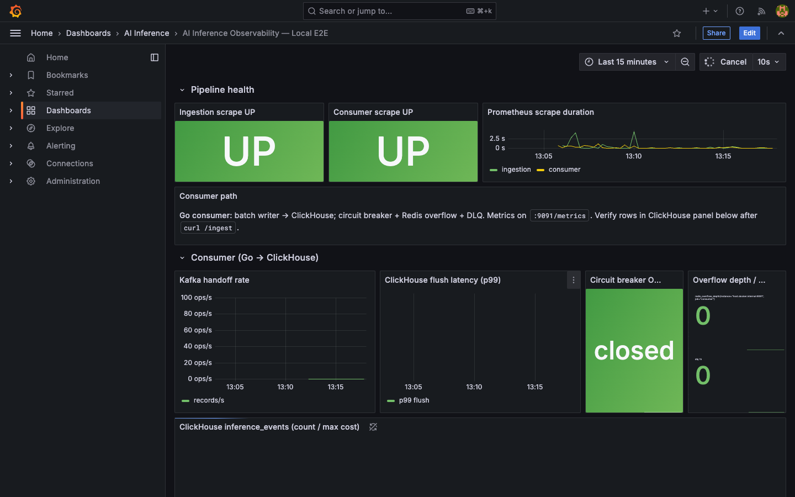
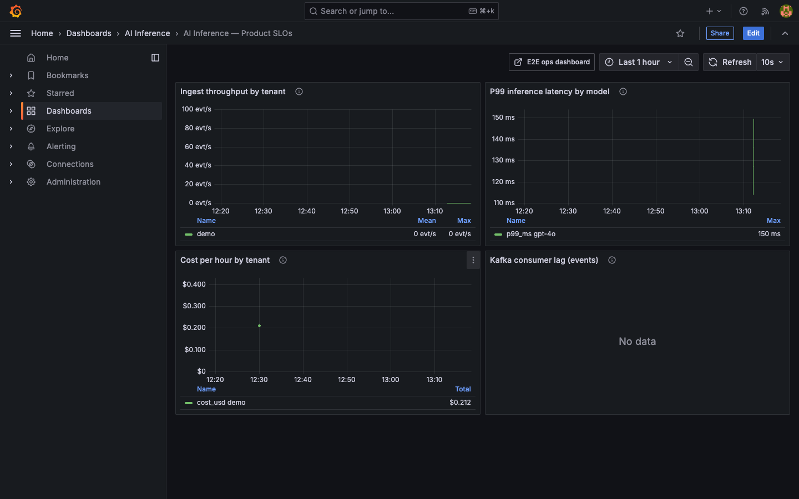
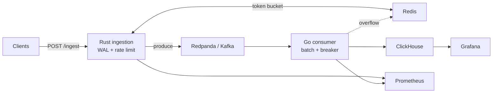

# infra-ai-streaming

**Sub-100ms AI inference observability at 1M events/min — Kafka-backed, ClickHouse-native, multi-tenant.**

Open-source streaming pipeline for LLM inference events: HTTP ingest with WAL durability, Kafka transport, Go batch consumer to ClickHouse, Redis rate limits and overflow, Prometheus metrics, and Grafana dashboards.

[](https://github.com/AkshantVats/infra-ai-streaming/actions/workflows/ci.yml)
[](LICENSE)

---

## Quick start

**Prerequisites:** Docker (8 GB+ RAM for full stack), Rust 1.88+, Go 1.22+, cmake. For Kubernetes E2E: `k3d`, `helm`, `kubectl`.

```bash
git clone https://github.com/AkshantVats/infra-ai-streaming.git
cd infra-ai-streaming
./scripts/run.sh --profile m1
```

That runs unit tests, deploys the full stack on k3d with M1-safe resource limits, smoke tests, and chaos scenarios. E2E summary matrix: [`docs/E2E-PROOF-K3D.md`](docs/E2E-PROOF-K3D.md) (full logs are CI artifacts).

**Docker Compose only** (host binaries for ingestion/consumer):

```bash
./scripts/run.sh --profile m1 --target compose
# Terminal A: cd consumer && set -a && source deploy/compose/values-m1.env && set +a && go run ./cmd/consumer
# Terminal B: set -a && source deploy/compose/values-m1.env && set +a && cargo run -p ingestion
curl -sS -X POST http://localhost:8080/ingest -H 'Content-Type: application/json' -H 'X-Tenant-ID: demo' \
  -d '{"events":[{"tenant_id":"demo","model_id":"gpt-4o","timestamp_unix_ms":1715000000000,"latency_ms":342,"prompt_tokens":512,"completion_tokens":128,"cost_usd":0.00423,"status":"success"}]}'
```

Grafana (Compose stack): http://localhost:3000 (`admin` / `admin`). After `./scripts/run.sh --profile m1 --target compose`, start ingestion + consumer on the host (see Quick start above), then open the dashboards below. Screenshot capture: [`docs/screenshots/README.md`](docs/screenshots/README.md).





---

## Configuration profiles

All deploy paths are config-driven via `./scripts/run.sh`.

| Profile | Helm values | Compose env | Use case |
|---------|-------------|-------------|----------|
| `m1` (default) | `deploy/helm/lensai/values-m1.yaml` | `deploy/compose/values-m1.env` | Apple Silicon / low RAM |
| `dev` | `deploy/helm/lensai/values-dev.yaml` | `deploy/compose/values-dev.env` | Minimal single-replica |
| `default` | `deploy/helm/lensai/values.yaml` | `deploy/compose/values-dev.env` | Production-shaped defaults |
| `k3d` | `deploy/helm/lensai/values-k3d.yaml` | — | Workstation k3d + HPA demo |

**Custom cluster:** copy the example and pass `--values`:

```bash
cp deploy/helm/lensai/values.example.yaml deploy/helm/lensai/values.mycluster.yaml
# edit values.mycluster.yaml
./scripts/run.sh --values deploy/helm/lensai/values.mycluster.yaml --target helm
```

| Command | What it does |
|---------|----------------|
| `./scripts/run.sh --profile m1` | Full k3d E2E (default) |
| `./scripts/run.sh --profile m1 --skip-chaos` | E2E without chaos steps |
| `./scripts/run.sh --profile m1 --target compose` | Docker Compose up |
| `./scripts/run.sh --values path/to/custom.yaml` | Custom Helm values |
| `LENSAI_PROFILE=m1 ./scripts/run.sh` | Profile via environment |

See [`deploy/README.md`](deploy/README.md) for ports, troubleshooting, and manual Helm steps.

---

## Architecture

Ingestion is **AP-oriented**: accept and durably record quickly (WAL + Kafka), then make data **eventually consistent** in ClickHouse. The Go consumer batches writes, protects ClickHouse with a circuit breaker, spills to Redis when the analytical path is degraded, and runs **z-score latency anomaly detection** per `tenant_id:model_id` pair (window 100, 3σ) — routing anomalies to the `ai_anomalies` Kafka topic.

**Features:**
- WAL-durable HTTP ingest (Rust/Axum) — P99 < 100 ms to accepted+WAL boundary
- Per-tenant Redis token-bucket rate limits (fail-open on Redis loss)
- Go batch consumer → ClickHouse with circuit breaker + Redis overflow + DLQ
- **Latency anomalies:** z-score on `latency_ms` per `tenant_id:model_id` → `ai_anomalies` topic → `anomalies_detected_total{tenant_id,model_id}` — Grafana alert `consumer-latency-zscore-anomalies.yaml`
- Prometheus metrics on `:8080` (ingestion) and `:9091` (consumer); Grafana Product SLO + Local E2E dashboards
- Helm chart with HPA on consumer Kafka lag; k3d E2E proof in `docs/E2E-PROOF-K3D.md`

→ [Architecture (evergreen)](docs/ARCHITECTURE.md) · [Full flows & troubleshooting](docs/ARCHITECTURE-AND-FLOWS.md) · [Design decisions](DESIGN.md)

<!-- Add docs/images/architecture.png after capture; see docs/images/README.md -->
<!--  -->



---

## Design decisions

Three explicit tradeoffs — each with context, choice, and consequence — for reviewers who want more than a component list.

| # | Decision | Why | Tradeoff |
|---|----------|-----|----------|
| **1** | **Rust for ingestion** | Bounded P99 on the validate → WAL → produce path; no GC pauses on the hot path | Slower iteration velocity for some teams vs. Go |
| **2** | **ClickHouse over TimescaleDB** | OLAP-shaped rollups (`cost_usd`, tokens, P99 by `tenant_id × model_id`) at billions of rows without series-count limits | Not a general OLTP store; `FINAL` dedup cost on reads |
| **3** | **AP at the ingest edge** | WAL + Kafka before ClickHouse visibility; 202 after durable accept; avoids blocking the inference critical path | Analytics are **eventually consistent**; at-least-once → warehouse dedup required |

Full rationale: [DESIGN.md](DESIGN.md) §2 (CAP), §3 (partitioning), §5 (failure modes).

---

## Benchmarks

Engineering targets: **1 M events/min**, ingest **P99 < 100 ms** (accept + WAL + enqueue boundary). Measured numbers come from k6 — see **[BENCHMARKS.md](BENCHMARKS.md)**.

| Scenario | VUs | Events/sec (target) | HTTP P99 | CH flush P99 | Max Kafka lag | Error rate |
|----------|-----|---------------------|----------|--------------|---------------|------------|
| Steady   | 50  | ~5,000              | [TBD]    | [TBD]        | [TBD]         | [TBD]      |
| Stress   | 200 | ~20,000             | [TBD]    | [TBD]        | [TBD]         | [TBD]      |

> **Honest:** `[TBD]` until `k6 run load-test/k6-script.js` (script planned; `./chaos/run_chaos.sh load-10k` is a partial throughput signal). Full methodology and hardware context: [BENCHMARKS.md](BENCHMARKS.md).

---

## Chaos testing

Five failure modes documented with local repro, metrics, and recovery in **[CHAOS.md](CHAOS.md)**. Automated scripts: `./chaos/run_chaos.sh` (`kill-redpanda`, `throttle-clickhouse`, `load-10k`).

| # | Scenario | Ingest | Consumer | Data loss | Key metric |
|---|----------|--------|----------|-----------|------------|
| 1 | Kafka down | 202 (WAL) | Stalled | None (WAL replay) | `kafka_produce_errors_total` |
| 2 | ClickHouse down | 202 | Breaker → Redis overflow | None (overflow/DLQ) | `circuit_breaker_state`, `redis_overflow_depth` |
| 3 | Redis down | 202 **fail-open** | Normal | None (fairness lost) | `redis_rate_limit_degraded_total` |
| 4 | Ingest OOM/kill | Down briefly | Normal | None (WAL replay) | `wal_replay_events_total` |
| 5 | CH network partition | 202 | Breaker, lag grows | None (offsets replay) | `kafka_consumer_lag_events` |

**Philosophy:** fail-open on Redis is intentional; at-least-once with warehouse dedup; every failure emits a Prometheus signal — see Grafana **Local E2E** dashboard.

---

## Development

**Local CI matrix** (matches GitHub Actions):

```bash
cargo fmt --check
cargo clippy -p ingestion --all-targets -- -D warnings
cargo test -p ingestion
(cd consumer && test -z "$(gofmt -l .)" && go test ./...)
helm dependency update deploy/helm/lensai
helm template lensai deploy/helm/lensai -n lensai -f deploy/helm/lensai/values-m1.yaml >/dev/null
shellcheck -x chaos/*.sh deploy/k3d/*.sh deploy/helm/lensai/files/*.sh deploy/redpanda/*.sh scripts/*.sh
```

| Workflow | When | What |
|----------|------|------|
| [CI](.github/workflows/ci.yml) | Every PR / push to `main` | Rust, Go, Helm, shellcheck, gitleaks, **k3d E2E** (`e2e-k3d` job) |
| [E2E k3d dispatch](.github/workflows/e2e-k3d-dispatch.yml) | Weekly + manual | Same `./scripts/run.sh --profile m1` (scheduled signal) |

macOS setup: [`docs/dev-macos.md`](docs/dev-macos.md). Project status and roadmap: [`docs/PROJECT-STATUS.md`](docs/PROJECT-STATUS.md).

---

## Repository layout

```
infra-ai-streaming/
├── ingestion/          # Rust — Axum HTTP, WAL, Kafka producer
├── consumer/           # Go — Kafka reader, ClickHouse writer
├── deploy/             # Compose, Helm, k3d, Grafana, Prometheus
├── dashboards/         # Grafana JSON exports
├── chaos/              # Failure injection scripts
├── scripts/run.sh      # Config-driven deploy entry point
└── docs/               # Architecture, runbook, E2E checklist
```

---

## Operations

| Doc | Purpose |
|-----|---------|
| [OBSERVABILITY.md](OBSERVABILITY.md) | Metrics catalog, SLO sketches |
| [CHAOS.md](CHAOS.md) | Reproducible failure scenarios |
| [docs/RUNBOOK.md](docs/RUNBOOK.md) | Symptom → checks → actions |
| [docs/PRODUCTION-READINESS-CHECKLIST.md](docs/PRODUCTION-READINESS-CHECKLIST.md) | OSS/prod posture |
| [docs/E2E-CHECKLIST.md](docs/E2E-CHECKLIST.md) | Manual verification steps |

---

## Contributing

See [CONTRIBUTING.md](CONTRIBUTING.md). Security issues: [SECURITY.md](SECURITY.md).

---

## License

[MIT](LICENSE).
