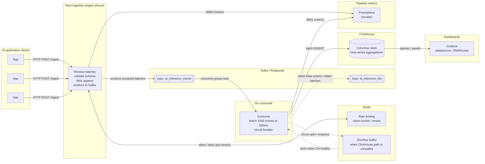

# infra-ai-streaming

**Sub-100ms AI inference observability at 1M events/min — Kafka-backed, ClickHouse-native, multi-tenant.**

**Honest status:** the repo ships a tested **Rust ingestion library** and **runnable `ingestion` binary**, a **Go consumer** (Kafka → ClickHouse batch writer, circuit breaker, Redis overflow, DLQ), CI, design docs, and a **local Docker stack** (Redis, Redpanda, ClickHouse, Prometheus, Grafana). See [docs/PROJECT-STATUS.md](docs/PROJECT-STATUS.md), **[docs/ARCHITECTURE-AND-FLOWS.md](docs/ARCHITECTURE-AND-FLOWS.md)** (architecture, lifecycles, observability matrix), [OBSERVABILITY.md](OBSERVABILITY.md), and [CHAOS.md](CHAOS.md) (five failure scenarios with local repro). Build plan: [docs/7-day-plan.md](docs/7-day-plan.md).

[](https://github.com/AkshantVats/infra-ai-streaming/actions/workflows/ci.yml)
[](LICENSE)
[](#)

Production-grade streaming pipeline for LLM inference events: ingest, durably buffer, stream-process, and query at cardinality and throughput where application-layer tracing tools and Prometheus-style metrics backends stop being viable.

---

## Why this exists

Prometheus (and similar pull-based metrics stores) breaks when `model_id × tenant_id × deployment` explodes series cardinality; LLM inference telemetry routinely crosses that threshold. Application-layer LLM tools optimize for traces and prompt UX, not for a replayable event bus, bounded hot-path latency, or per-tenant cost accounting at Kafka-scale throughput. There is no widely adopted open stack that combines multi-tenant `cost_usd` isolation, durable streaming, and columnar analytics purpose-built for inference-shaped payloads — this project is that stack.

---

## Architecture overview

Ingestion is **AP-oriented**: accept and durably record quickly (WAL + Kafka), then make data **eventually consistent** in ClickHouse. The Go consumer batches writes, protects ClickHouse with a circuit breaker, and spills to Redis when the analytical path is degraded. Prometheus scrapes both services; Grafana reads ClickHouse for product dashboards.

→ [Read the full design document](DESIGN.md)

<!-- architecture-diagram-start -->



<!-- architecture-diagram-end -->

*(Diagram: left-to-right flow from clients through ingestion, Kafka, consumer, ClickHouse, and observability sidecars.)*

---

## Features

Implemented vs planned (see [docs/PROJECT-STATUS.md](docs/PROJECT-STATUS.md)):

- **Rust (Axum) HTTP ingestion** *(Day 3)*: `POST /ingest`, schema validation, Redis rate limits, bounded `mpsc` backpressure (`503` + `Retry-After` when the channel is full).
- **WAL before Kafka produce** *(Day 3)*: segment WAL + fsync before accept; unacked replay on startup; `mark_acked` after broker delivery (at-least-once).
- **Kafka / Redpanda**: `ai_inference_events` as primary stream; `ai_inference_dlq` for poison or persistently failing batches.
- **Go stream consumer**: franz-go reader; **1000 events or 500ms** batch flush to ClickHouse; **circuit breaker** (5 failures → open, 30s half-open); **Redis LIST overflow**; **DLQ** after 3 insert retries; offsets commit after handoff.
- **Redis**: distributed **token-bucket rate limit per `tenant_id`** on ingest (per-tenant config via `TENANT_LIMITS_PATH` JSON file — see `deploy/tenant-limits.example.json`); **overflow buffer** when ClickHouse is slow or unavailable. **Fail-open** when Redis is unavailable (documented in [CHAOS.md](CHAOS.md) §3).
- **ClickHouse**: MergeTree-style storage, high-cardinality dimensions (`tenant_id`, `model_id`), time-range scans optimized for rollups and dashboards.
- **Self-observability**: Prometheus scrapes Rust and Go (`/metrics`) — ingestion latency histograms, Kafka consumer lag, DLQ depth, circuit-breaker state.
- **Grafana**: **Product SLOs** dashboard (tenant throughput, P99 by model, cost/hour, consumer lag) plus **Local E2E** ops board — provisioned from `dashboards/`.
- **OpenTelemetry**: OTLP export across Rust and Go (planned wiring in compose).
- **Kubernetes / Helm**: stateless ingest scales horizontally; HPA hooks on **Kafka lag**, not CPU alone (planned charts).

---

## Tech stack

| Component | Technology | Why |
|-----------|------------|-----|
| HTTP ingestion | Rust + Axum + Tokio | Predictable hot-path latency; no GC pauses on the accept/validate/encode path. |
| Event transport | Apache Kafka / Redpanda | Durable log, partition scaling, consumer groups, replay for backfills and failures. |
| Stream processor | Go | Straightforward batching, flush timers, and concurrent I/O for consumer → ClickHouse. |
| Analytical store | ClickHouse | Columnar engine tuned for high-cardinality, time-range aggregation, and rollup MVs at this event shape. |
| Rate limiting | Redis + Lua | Atomic token bucket across many ingest replicas. |
| Degraded-path buffer | Redis (LIST) | Cheap spillover when ClickHouse rejects or times out; drain when healthy. |
| Metrics | Prometheus | First-class histograms, gauges for lag/DLQ, standard scrape model. |
| Dashboards | Grafana | SQL to ClickHouse for cost/latency/token panels. |
| Tracing | OpenTelemetry (OTLP) | Vendor-neutral propagation across services. |
| Deployment | Kubernetes + Helm | Pod autoscaling; lag-driven HPA on consumers. |

---

## Target metrics (design goals)

| Throughput | Ingestion P99 | Storage model | Cardinality support |
|------------|---------------|---------------|---------------------|
| **1M events/min** (horizontal scale) | **< 100 ms** server-side to accepted+durable boundary (WAL + enqueue/produce path) | Columnar MergeTree family; raw TTL + rollups TBD in `DESIGN.md` | **High** — `tenant_id`, `model_id`, status dimensions without Prometheus series explosion |

*Numbers are engineering targets validated under load tests (k6) as the implementation lands; not benchmarks yet.*

---

## Getting started

> **Status:** Ingestion **library + binary** build and test locally (`./scripts/test-ingestion.sh`). For **HTTP → WAL → Kafka → Go stdout**, use the three-terminal flow below or [`scripts/smoke-e2e.sh`](scripts/smoke-e2e.sh).

**Prerequisites:** Rust **1.86+** (see [`rust-toolchain.toml`](rust-toolchain.toml)), **Go 1.22+**, **cmake** (for `rdkafka`), Docker when you run the full local stack.

**Contributing:** [CONTRIBUTING.md](CONTRIBUTING.md) (clone, toolchain, `cargo test`, Compose, PR expectations).

### Local development (macOS)

See **[docs/dev-macos.md](docs/dev-macos.md)** for Xcode Command Line Tools, Homebrew, `brew install cmake`, rustup, and `cargo test -p ingestion`. Optional: `brew install redis` for future integration tests.

### Local dependencies (Docker)

[`deploy/docker-compose.yml`](deploy/docker-compose.yml) runs **Redis** (6379), **Redpanda** (Kafka API **9092**, admin **9644**), **ClickHouse** (**8123** / **9000**), **Prometheus** (**9090**), and **Grafana** (**3000**), plus one-shot `redpanda-init` and `clickhouse-init`. Full `InferenceEvent` DDL: [`deploy/clickhouse/init.sql`](deploy/clickhouse/init.sql).

```bash
cp deploy/.env.example deploy/.env
docker compose --env-file deploy/.env -f deploy/docker-compose.yml up -d
```

[`deploy/.env.example`](deploy/.env.example) lists the same `KAFKA_*`, `REDIS_*`, `WAL_DIR`, `HTTP_PORT`, etc. names as [`ingestion/src/config.rs`](ingestion/src/config.rs). **Unit tests** (`cargo test -p ingestion`) do **not** require Compose. **Running the binary** needs Redis and a Kafka-compatible broker—use Compose **Redpanda on `127.0.0.1:9092`** (not a separate native Kafka install on macOS).

**Resource note:** ClickHouse is the heaviest service in this stack; on laptops with limited RAM, start Redis + Redpanda only if you only need streaming deps.

```bash
git clone https://github.com/YOURUSERNAME/infra-ai-streaming.git
cd infra-ai-streaming
# macOS: brew install cmake   (required for rdkafka native build)
# Linux (Debian/Ubuntu): sudo apt-get install -y cmake pkg-config libssl-dev libsasl2-dev libzstd-dev libcurl4-openssl-dev
./scripts/test-ingestion.sh
# or: cargo test -p ingestion
# Same tests inside Docker (slower first run; use if you have no local Rust):
# ./scripts/docker-test-ingestion.sh
# If Docker exits with 137, the compile was likely OOM-killed — lower jobs:
# CARGO_BUILD_JOBS=1 CMAKE_BUILD_PARALLEL_LEVEL=1 ./scripts/docker-test-ingestion.sh

# E2E (after: cp deploy/.env.example deploy/.env && docker compose … up -d):
# Terminal A — consumer:
#   set -a && source deploy/.env && set +a && export KAFKA_BROKERS=127.0.0.1:9092
#   go run ./consumer/cmd/consumer
# Terminal B — ingestion:
#   set -a && source deploy/.env && set +a && cargo run -p ingestion
# Terminal C — ingest (or ./scripts/smoke-e2e.sh)
# Observability: http://localhost:9090/targets  http://localhost:3000 (admin/admin)
#   Product SLOs: /d/ai-inference-product  |  Local E2E ops: /d/ai-inference-e2e-local
```

### 3-step demo (quick)

1. `docker compose --env-file deploy/.env -f deploy/docker-compose.yml up -d`
2. Run **consumer** (`cd consumer && go run ./cmd/consumer`) and **ingestion** (`cargo run -p ingestion`) with `deploy/.env` sourced; `KAFKA_BROKERS=127.0.0.1:9092` for the consumer.
3. `curl` `/ingest` (example below) → verify Kafka (`rpk topic consume`) and consumer stdout (`cost_usd=0.00423`). Grafana: http://localhost:3000.

### Per-tenant rate limit demo

Set `TENANT_LIMITS_PATH=deploy/tenant-limits.example.json` when starting ingestion to enable per-tenant limits (`tenant-demo` = 5 rps, `tenant-premium` = 50k rps, `tenant-free` = 100 rps). Then:

```bash
./scripts/demo-flows.sh per-tenant-limit   # tenant-demo gets 429, tenant-b is fine
./scripts/demo-flows.sh fail-open          # stop Redis → fail-open → start Redis → limits resume
```

See [CHAOS.md](CHAOS.md) for the full four-scene demo story and five failure scenarios.

### Grafana

| Dashboard | URL | Purpose |
|-----------|-----|---------|
| **AI Inference — Product SLOs** | http://localhost:3000/d/ai-inference-product | Tenant ingest rate, inference P99 by `model_id`, USD/hour, Kafka lag |
| **AI Inference Observability — Local E2E** | http://localhost:3000/d/ai-inference-e2e-local | Scrape health, breaker, overflow, DLQ, WAL |

Login: `admin` / `admin`. Canonical JSON: [`dashboards/`](dashboards/). Details: [OBSERVABILITY.md](OBSERVABILITY.md), [docs/ARCHITECTURE-AND-FLOWS.md](docs/ARCHITECTURE-AND-FLOWS.md), [docs/END-TO-END-FLOWS.md](docs/END-TO-END-FLOWS.md), `./scripts/demo-flows.sh`.

### Troubleshooting

Scrape failures, stuck Kafka offsets, empty ClickHouse Grafana panels, breaker/overflow: [docs/ARCHITECTURE-AND-FLOWS.md#8-troubleshooting](docs/ARCHITECTURE-AND-FLOWS.md#8-troubleshooting).

<!-- After smoke ingest, capture http://localhost:3000/d/ai-inference-product → docs/screenshots/grafana-product-slo.png -->
<!--  -->

Example ingest (with binary running; schema aligns with `DESIGN.md` / [`deploy/clickhouse/init.sql`](deploy/clickhouse/init.sql)):

```bash
curl -sS -X POST http://localhost:8080/ingest \
  -H "Content-Type: application/json" \
  -H "X-Tenant-ID: demo" \
  -d '{"events":[{"tenant_id":"demo","model_id":"gpt-4o","timestamp_unix_ms":1715000000000,"latency_ms":342,"prompt_tokens":512,"completion_tokens":128,"cost_usd":0.00423,"status":"success"}]}'
```

---

## Design decisions

### (a) Rust for ingestion

The ingest path is latency-sensitive and allocation-heavy under batch decoding. A GC’d runtime can pause at the wrong quantile and inflate P99 under churn; Rust + Tokio keeps the accept → validate → serialize → handoff path bounded and explicit. The hard work (compression, TLS, Kafka client backpressure) still happens — but on threads and budgets you control.

### (b) ClickHouse over TimescaleDB

This workload is **append-mostly analytical fact tables** with **wide, repetitive dimensions** and **sub-second dashboard queries** over billions of rows. ClickHouse’s columnar encoding and vectorized execution match aggregate-heavy panels (cost, tokens, latency percentiles by tenant/model) better than row-oriented Postgres hypertables at the same hardware envelope. Timescale remains excellent for many metrics workloads; here the dominant access pattern is OLAP-shaped.

### (c) AP over CP at the ingestion boundary

Ingest optimizes **availability** and **honest overload behavior**: prefer accepting work into a durable log (WAL + Kafka) over synchronously waiting for global consistency with the analytical store. We explicitly trade **immediate cross-system consistency** for **bounded client latency** and **replayability**. Duplicates are handled as a data-plane concern (`event_id`, idempotent consumers, optional ReplacingMergeTree) rather than blocking callers on ClickHouse write quorum.

---

## Roadmap

1. **Semantic cache layer** — embedding-backed prompt deduplication API (optional sidecar) to cut duplicate spend.
2. **Multi-region ClickHouse** — replication and read fanout for geo-distributed tenants.
3. **eBPF / host-level probes** — zero-SDK capture path for inference calls where HTTP ingest is not possible.
4. **Cost anomaly detection** — budget burn-rate alerts per tenant (Z-score / EWMA on hourly rollups).
5. **AI gateway integration** — treat this repo as the observability backend behind Envoy/APISIX-style gateways.

---

## Repository layout (planned)

```
infra-ai-streaming/
├── ingestion/          # Rust — Axum binary, WAL, Kafka producer, rate limit client
├── consumer/           # Go — Kafka reader (stdout Day 4; CH writer Day 5)
├── deploy/             # docker-compose, Prometheus, Grafana, ClickHouse init
├── dashboards/         # Grafana JSON exports
├── load-test/          # k6 scripts
├── chaos/              # scripted failure injections
└── docs/               # ARCHITECTURE-AND-FLOWS.md, END-TO-END-FLOWS.md, PROJECT-STATUS.md
```

---

## License

[MIT](LICENSE).

---

## Acknowledgements

Built as an open, infrastructure-native alternative to SDK-only LLM observability stacks — optimized for **durability**, **cardinality**, and **per-tenant cost** at streaming scale.
