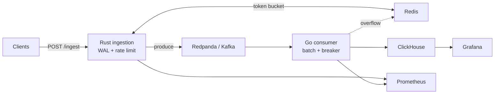

# infra-ai-streaming

**Sub-100ms AI inference observability at 1M events/min — Kafka-backed, ClickHouse-native, multi-tenant.**

Open-source streaming pipeline for LLM inference events: HTTP ingest with WAL durability, Kafka transport, Go batch consumer to ClickHouse, Redis rate limits and overflow, Prometheus metrics, and Grafana dashboards.

[](https://github.com/AkshantVats/infra-ai-streaming/actions/workflows/ci.yml)
[](LICENSE)

---

## Quick start

**Prerequisites:** Docker (8 GB+ RAM for full stack), Rust 1.86+, Go 1.22+, cmake. For Kubernetes E2E: `k3d`, `helm`, `kubectl`.

```bash
git clone https://github.com/AkshantVats/infra-ai-streaming.git
cd infra-ai-streaming
./scripts/run.sh --profile m1
```

That runs unit tests, deploys the full stack on k3d with M1-safe resource limits, smoke tests, and chaos scenarios. Proof log: [`docs/E2E-PROOF-K3D.md`](docs/E2E-PROOF-K3D.md).

**Docker Compose only** (host binaries for ingestion/consumer):

```bash
./scripts/run.sh --profile m1 --target compose
# Terminal A: cd consumer && set -a && source deploy/compose/values-m1.env && set +a && go run ./cmd/consumer
# Terminal B: set -a && source deploy/compose/values-m1.env && set +a && cargo run -p ingestion
curl -sS -X POST http://localhost:8080/ingest -H 'Content-Type: application/json' -H 'X-Tenant-ID: demo' \
  -d '{"events":[{"tenant_id":"demo","model_id":"gpt-4o","timestamp_unix_ms":1715000000000,"latency_ms":342,"prompt_tokens":512,"completion_tokens":128,"cost_usd":0.00423,"status":"success"}]}'
```

Grafana: http://localhost:3000 (`admin` / `admin`).

---

## Configuration profiles

All deploy paths are config-driven via `./scripts/run.sh`.

| Profile | Helm values | Compose env | Use case |
|---------|-------------|-------------|----------|
| `m1` (default) | `deploy/helm/lensai/values-m1.yaml` | `deploy/compose/values-m1.env` | Apple Silicon / low RAM |
| `dev` | `deploy/helm/lensai/values-dev.yaml` | `deploy/compose/values-dev.env` | Minimal single-replica |
| `default` | `deploy/helm/lensai/values.yaml` | `deploy/compose/values-dev.env` | Production-shaped defaults |
| `k3d` | `deploy/helm/lensai/values-k3d.yaml` | — | Workstation k3d + HPA demo |

**Custom cluster:** copy the example and pass `--values`:

```bash
cp deploy/helm/lensai/values.example.yaml deploy/helm/lensai/values.mycluster.yaml
# edit values.mycluster.yaml
./scripts/run.sh --values deploy/helm/lensai/values.mycluster.yaml --target helm
```

| Command | What it does |
|---------|----------------|
| `./scripts/run.sh --profile m1` | Full k3d E2E (default) |
| `./scripts/run.sh --profile m1 --skip-chaos` | E2E without chaos steps |
| `./scripts/run.sh --profile m1 --target compose` | Docker Compose up |
| `./scripts/run.sh --values path/to/custom.yaml` | Custom Helm values |
| `LENSAI_PROFILE=m1 ./scripts/run.sh` | Profile via environment |

See [`deploy/README.md`](deploy/README.md) for ports, troubleshooting, and manual Helm steps.

---

## Architecture

Ingestion is **AP-oriented**: accept and durably record quickly (WAL + Kafka), then make data **eventually consistent** in ClickHouse. The Go consumer batches writes, protects ClickHouse with a circuit breaker, and spills to Redis when the analytical path is degraded.

→ [Architecture (evergreen)](docs/ARCHITECTURE.md) · [Full flows & troubleshooting](docs/ARCHITECTURE-AND-FLOWS.md) · [Design decisions](DESIGN.md)



---

## Development

**Local CI matrix** (matches GitHub Actions):

```bash
cargo fmt --check
cargo clippy -p ingestion -- -D warnings
cargo test -p ingestion
(cd consumer && test -z "$(gofmt -l .)" && go test ./...)
helm dependency update deploy/helm/lensai
helm template lensai deploy/helm/lensai -n lensai -f deploy/helm/lensai/values-m1.yaml >/dev/null
shellcheck -x chaos/*.sh deploy/k3d/*.sh deploy/helm/lensai/files/*.sh deploy/redpanda/*.sh scripts/*.sh
```

| Workflow | When | What |
|----------|------|------|
| [CI](.github/workflows/ci.yml) | Every PR / push to `main` | Rust, Go, Helm, shellcheck, gitleaks |
| [E2E k3d](.github/workflows/e2e-k3d-dispatch.yml) | Weekly + manual | `./scripts/run.sh --profile m1` |

macOS setup: [`docs/dev-macos.md`](docs/dev-macos.md). Project status and roadmap: [`docs/PROJECT-STATUS.md`](docs/PROJECT-STATUS.md).

---

## Repository layout

```
infra-ai-streaming/
├── ingestion/          # Rust — Axum HTTP, WAL, Kafka producer
├── consumer/           # Go — Kafka reader, ClickHouse writer
├── deploy/             # Compose, Helm, k3d, Grafana, Prometheus
├── dashboards/         # Grafana JSON exports
├── chaos/              # Failure injection scripts
├── scripts/run.sh      # Config-driven deploy entry point
└── docs/               # Architecture, runbook, E2E checklist
```

---

## Operations

| Doc | Purpose |
|-----|---------|
| [OBSERVABILITY.md](OBSERVABILITY.md) | Metrics catalog, SLO sketches |
| [CHAOS.md](CHAOS.md) | Reproducible failure scenarios |
| [docs/RUNBOOK.md](docs/RUNBOOK.md) | Symptom → checks → actions |
| [docs/PRODUCTION-READINESS-CHECKLIST.md](docs/PRODUCTION-READINESS-CHECKLIST.md) | OSS/prod posture |
| [docs/E2E-CHECKLIST.md](docs/E2E-CHECKLIST.md) | Manual verification steps |

---

## Contributing

See [CONTRIBUTING.md](CONTRIBUTING.md). Security issues: [SECURITY.md](SECURITY.md).

---

## License

[MIT](LICENSE).
