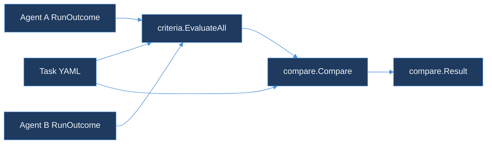

# agent-benchmark-runner

> Compare two agent runs against the same task YAML, graded on explicit success criteria.
> Part of the TraceForge observability suite.

## Why

"Agent A feels better than agent B" isn't a benchmark result — it's an opinion. This
package fixes the scenario (prompt, seed, allowed tools) and the pass bar (a list of
typed success criteria) as data, so comparing two agents is a function of two recorded
run outcomes and one task file, not a judgment call made after reading transcripts.

## Quickstart

```bash
go test ./...
```

## Architecture



## Design

See [DESIGN.md](DESIGN.md) for the task YAML schema, the closed set of success criteria
types and why free-form assertion scripts and LLM-judge grading were rejected, and how
two-agent divergence is computed and reported separately from pass/fail.

## Packages

| Package | Purpose |
|---|---|
| `pkg/task` | `Task` and `Criterion` types, YAML loading, structural validation |
| `pkg/criteria` | Grades one run's outcome against a task's success criteria |
| `pkg/compare` | Grades two agents on the same task and reports their first tool-call divergence |

## Sample task

[`testdata/checkout-happy-path.yaml`](testdata/checkout-happy-path.yaml) is a minimal
task exercising all three criterion types (`final_output_contains`, `tool_call_sequence`,
`max_tool_calls`).

## License

MIT — see [../LICENSE](../LICENSE).
