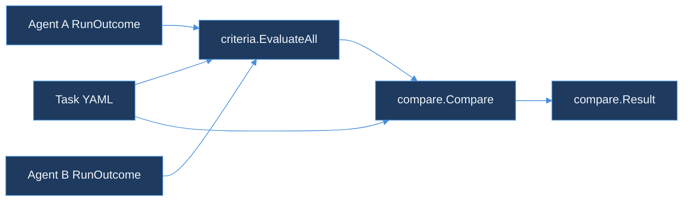

# agent-benchmark-runner

> Compare two agent runs against the same task YAML, graded on explicit success criteria.
> Part of the TraceForge observability suite.

## Why

"Agent A feels better than agent B" isn't a benchmark result — it's an opinion. This
package fixes the scenario (prompt, seed, allowed tools) and the pass bar (a list of
typed success criteria) as data, so comparing two agents is a function of two recorded
run outcomes and one task file, not a judgment call made after reading transcripts.

## Quickstart

```bash
go test ./...
```

Run the ClickHouse-touching tests (skipped by default) against a local instance:

```bash
CLICKHOUSE_DSN="clickhouse://localhost:9000" go test -tags=integration ./pkg/store/...
```

## Architecture



## Design

See [DESIGN.md](DESIGN.md) for the task YAML schema, the closed set of success criteria
types and why free-form assertion scripts and LLM-judge grading were rejected, and how
two-agent divergence is computed and reported separately from pass/fail.

## Packages

| Package | Purpose |
|---|---|
| `pkg/task` | `Task` and `Criterion` types, YAML loading, structural validation |
| `pkg/criteria` | Grades one run's outcome against a task's success criteria |
| `pkg/compare` | Grades two agents on the same task and reports their first tool-call divergence |
| `pkg/orchestrator` | Runs a Task N times against one agent under bounded concurrency; summarizes pass rate (with a 95% CI) and step-count median/P95 |
| `pkg/store` | Persists an orchestrator batch to ClickHouse's `benchmark_runs` table, one row per repetition |
| `pkg/report` | Renders a `compare.Result` as markdown, JSON, an SVG timeline showing where two agents' tool calls diverged, or a cost-colored SVG flame graph showing where the budget went |
| `pkg/lensai` | Dual-writes a benchmark batch's completion onto LensAI's `/ingest` pipeline for unified tenant cost |

## Running N Times

A single run against a Task is an anecdote, not a benchmark — see
[DESIGN.md](DESIGN.md#running-a-task-n-times-day-52) for why `pkg/orchestrator` bounds
concurrency, derives a distinct reproducible seed per repetition, and reports a pass rate
with a confidence interval instead of one pass/fail.

```go
cfg := orchestrator.Config{
    Task:        t,
    AgentName:   "agent-a",
    Repetitions: 30,
    MaxParallel: 4, // bounded — see DESIGN.md's "Why Bounded Parallelism"
}
results, err := orchestrator.Run(ctx, cfg, myAgentFunc)
summary := orchestrator.Summarize(results)
// summary.PassRate, summary.CILow/CIHigh, summary.MedianSteps, summary.P95Steps

writer, err := store.NewClickHouseWriter(ctx, dsn)
records := store.NewRunRecords(t.TaskID, cfg.AgentName, results, time.Now().UTC())
err = writer.WriteRuns(ctx, records)
```

## Generating a Report

`pkg/report` turns a `compare.Result` into the report a reviewer actually reads — see
[DESIGN.md](DESIGN.md#generating-a-report-day-53) for why the headline leads with the
call-count/divergence comparison instead of a pass/fail badge, and why the timeline is a
hand-rolled SVG instead of a charting dependency.

```go
result := compare.Compare(t, runA, runB)
rpt := report.Build(result, runA.Outcome.ToolCallSequence, runB.Outcome.ToolCallSequence)
// rpt.Headline == "14 calls vs 9, diverged at step 5"

report.RenderMarkdown(os.Stdout, rpt)     // PR description / Slack message
report.RenderJSON(jsonFile, rpt)          // dashboards / alerting rules
report.RenderTimelineSVG(svgFile, rpt)    // side-by-side visual of where the runs split
```

## Cost Flame Graph

Divergence and cost are different questions — two runs can agree on every tool call and
still differ wildly in what those calls cost. `RenderFlameGraphSVG` renders a `CostReport`
the way a CPU flame graph renders a profile: box width proportional to cost, color on a
cool-to-hot gradient, the single most expensive call per row marked. See
[DESIGN.md](DESIGN.md#flame-graph-timeline--colored-by-cost-day-54) for why rows are
independent flame-graph strips rather than divergence-aligned columns, and why only the
single peak call is marked instead of every call above a threshold.

```go
costsA := []float64{0.004, 0.021, 0.412, 0.008} // per-call dollar cost, parallel to ToolCallsA
costsB := []float64{0.004, 0.019}

costRpt, err := report.BuildCostReport(rpt, costsA, costsB)
report.RenderFlameGraphSVG(svgFile, costRpt)    // widest, hottest box == where the budget died
```

## LensAI Ingest

A benchmark batch's completion — not each repetition — is dual-written onto LensAI's
shared `/ingest` pipeline, using the same envelope `tool-call-analyzer/pkg/lensai` already
uses for tool-call cost, discriminated by `source: "benchmark_run"`. See
[DESIGN.md](DESIGN.md#lensai-integration--benchmark-completion-emits-ingest-events-day-55)
for why `CostUSD` stays zero, why one event per batch instead of per repetition, and the
honest gap in how long the shared envelope stays safe to extend.

```go
summary := orchestrator.Summarize(results)

writer := lensai.New(os.Getenv("LENSAI_INGEST_URL"))
err := writer.Insert(ctx, summary, lensai.BatchParams{
    TaskID:      t.TaskID,
    AgentName:   cfg.AgentName,
    TenantID:    "acme",
    BatchID:     batchID,
    Duration:    time.Since(batchStart),
    CompletedAt: time.Now(),
})
```

## Sample task

[`testdata/checkout-happy-path.yaml`](testdata/checkout-happy-path.yaml) is a minimal
task exercising all three criterion types (`final_output_contains`, `tool_call_sequence`,
`max_tool_calls`).

## License

MIT — see [../LICENSE](../LICENSE).
