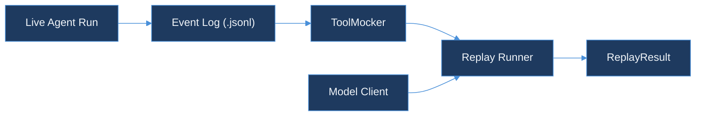

# agent-replay-engine

> Deterministic replay of AI agent runs.
> Part of the TraceForge observability suite.

## Why

An agent run is non-deterministic by default: the model issues tool calls, those calls hit live APIs, and the APIs return data that changes over time. Re-running the same prompt against live tools rarely reproduces a bug — the tool responses that triggered it are gone by the time you go looking.

`agent-replay-engine` records every step of a run as an immutable, append-only event log, then replays the run by feeding the model the same prompt while intercepting every tool call and returning the frozen response instead of hitting the live API. Same inputs in, same output out — every time.

## Quickstart

```bash
go test ./...
```

## Architecture



`pkg/eventlog` records a live run as an ordered `.jsonl` event log. `pkg/mocker.ToolMocker` loads that log and serves each tool call's frozen response by composite key (`tool_name` + `input_hash`), so a replay never reaches a live API. The replay runner and model client shown above are Day 45+ — see [Scope for Day 44](DESIGN.md#scope-for-day-44).

## Design

See [DESIGN.md](DESIGN.md) for the full event model, storage format, mock tool contract, and determinism rules.

## Packages

| Package | Purpose |
|---|---|
| `pkg/eventlog` | `AgentEvent` types, JSON Lines read/write, ordering + uniqueness validation |
| `pkg/mocker` | `ToolMocker` — frozen tool response server keyed by `SHA-256(tool_name + ":" + input_hash)` |

## Running Tests

```bash
go test ./...          # full suite, no external services required
go test -race ./...    # race detector — pkg/mocker has concurrent-access coverage
go build ./...
```

## Deviation note

This package lives at `agent-replay-engine/` inside `AkshantVats/infra-ai-streaming` rather than as a standalone `AkshantVats/agent-replay-engine` repo, following the precedent set by `tool-call-analyzer/` (Day 37). See [DESIGN.md § Deviation from the 150-day plan](DESIGN.md#deviation-from-the-150-day-plan).

## Contributing

1. Branch from `main`; branch names follow `<type>/<kebab-case-description>`.
2. Every new file carries `// SPDX-License-Identifier: MIT` as its first line.
3. `gofmt -l .` and `go vet ./...` must be clean on files you touch.
4. New behavior needs table-driven tests alongside it.
5. Open a PR against `main`.

## License

MIT — see [LICENSE](../LICENSE) at the repo root.
