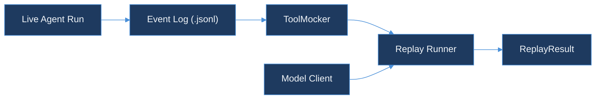

# agent-replay-engine

> Deterministic replay of AI agent runs.
> Part of the TraceForge observability suite.

## Why

An agent run is non-deterministic by default: the model issues tool calls, those calls hit live APIs, and the APIs return data that changes over time. Re-running the same prompt against live tools rarely reproduces a bug — the tool responses that triggered it are gone by the time you go looking.

`agent-replay-engine` records every step of a run as an immutable, append-only event log, then replays the run by feeding the model the same prompt while intercepting every tool call and returning the frozen response instead of hitting the live API. Same inputs in, same output out — every time.

## Quickstart

```bash
go test ./...
```

## Architecture



`pkg/eventlog` records a live run as an ordered `.jsonl` event log. `pkg/mocker.ToolMocker` loads that log and serves each tool call's frozen response by composite key (`tool_name` + `input_hash`), so a replay never reaches a live API. `pkg/replay.Run` walks the recorded tool-call sequence against the mocker and can halt after a chosen number of steps (`--stop-at-step`) instead of always running to the recorded `final_output`. The `Model Client` box above — a live model driving which tool calls get issued, so replay can detect model-induced divergence — is out of scope here; Day 46 replays the recorded call sequence directly. See [Scope for Day 44](DESIGN.md#scope-for-day-44).

## Design

See [DESIGN.md](DESIGN.md) for the full event model, storage format, mock tool contract, and determinism rules.

## CLI

```bash
go run ./cmd/traceforge replay --log run.jsonl --trace-id trace-1 --stop-at-step 6
```

`--stop-at-step` halts replay after that many recorded tool calls instead of running to `final_output` — useful to inspect a run's state right before a step you don't want to re-trigger yet, without re-running the whole trace. Omit it to replay to completion.

```bash
go run ./cmd/traceforge diff --log ab-run.jsonl --trace-a rider-a --trace-b rider-b
```

Finds the first `tool_call` step where two traces disagree, comparing `tool_name` + `input_hash` (structural, not raw-text) — see [DESIGN.md § Diff Algorithm](DESIGN.md#diff-algorithm).

## Packages

| Package | Purpose |
|---|---|
| `pkg/eventlog` | `AgentEvent` types, JSON Lines read/write, ordering + uniqueness validation, `FilterByTraceID` |
| `pkg/mocker` | `ToolMocker` — frozen tool response server keyed by `SHA-256(tool_name + ":" + input_hash)` |
| `pkg/export` | Trace export to object storage: zstd compression, checksums, hot/cold/expired retention (Day 45) |
| `pkg/objectstore` | Minimal object store interface + in-memory and MinIO implementations |
| `pkg/replay` | `Run` — replays a recorded event log against a `ToolMocker`, with an optional step limit (Day 46) |
| `pkg/diff` | `Compare` — finds the first diverging `tool_call` step between two traces (Day 47) |
| `cmd/traceforge` | CLI entry point; `replay` and `diff` subcommands |

## Running Tests

```bash
go test ./...          # full suite, no external services required
go test -race ./...    # race detector — pkg/mocker has concurrent-access coverage
go build ./...
```

## Deviation note

This package lives at `agent-replay-engine/` inside `AkshantVats/infra-ai-streaming` rather than as a standalone `AkshantVats/agent-replay-engine` repo, following the precedent set by `tool-call-analyzer/` (Day 37). See [DESIGN.md § Deviation from the 150-day plan](DESIGN.md#deviation-from-the-150-day-plan).

## Contributing

1. Branch from `main`; branch names follow `<type>/<kebab-case-description>`.
2. Every new file carries `// SPDX-License-Identifier: MIT` as its first line.
3. `gofmt -l .` and `go vet ./...` must be clean on files you touch.
4. New behavior needs table-driven tests alongside it.
5. Open a PR against `main`.

## License

MIT — see [LICENSE](../LICENSE) at the repo root.
