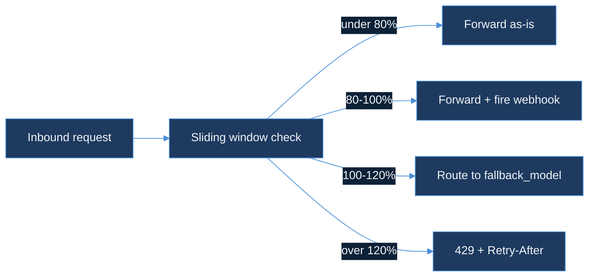
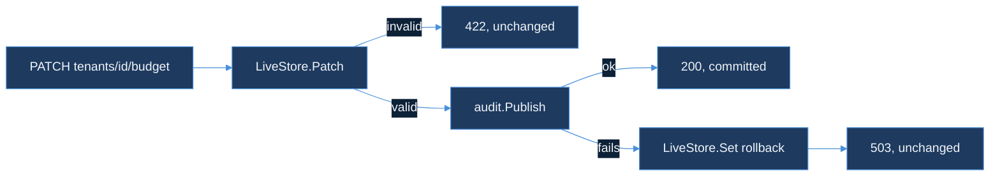

# cost-budget-enforcer — Design Document

| Field | Value |
|-------|-------|
| **Product arc** | RouteIQ (continues — opened Day 60 with `semantic-cache-engine`; `cost-budget-enforcer` is the arc's second module) |
| **Status** | Design-only. No runtime code, no migrations, no new Kafka topics yet. |
| **Precedent** | Same shape as `semantic-cache-engine`'s Day 60 DESIGN.md-first day, itself following `ebpf-llm-tracer`'s Day 14 precedent: the module opens with a written design before any implementation. |

**Document purpose.** `cost-budget-enforcer` caps how much a tenant can spend on LLM tokens inside a rolling window, and — critically — does something more useful than a flat rejection once that cap is close. This document records the four design decisions needed before any code is written: the sliding-window budget mechanism in Redis, the hard-vs-soft limit split, the graceful-degradation route to a cheaper model, and the webhook alert contract at 80% of budget.

---

## 1. Sliding-window token budget in Redis

**Sliding window counter, not sliding window log.** A sliding window log (one entry per request, trimmed on every check) gives an exact count but costs O(window size) memory and CPU per tenant per check. A fixed counter reset on a clock boundary is cheap but lets a tenant burn double budget by spending at the very end of one window and the very start of the next. The counter used here splits the difference: two fixed buckets per tenant (`current`, `previous`), and the effective count is `current + previous * (1 - elapsed_fraction_of_current_window)` — the same weighted-average approximation Cloudflare's and Wayfair's rate limiters both use for request counts, applied here to token counts instead.

**Why token counts, not request counts.** `semantic-cache-engine` and the root `ingestion` rate limiter both key on request volume; a budget enforcer has to key on `tokens_used` (extracted from each inference's usage report) because two requests are not equal cost — a 50-token completion and a 50,000-token one both count as "one request" under a request-rate limiter but are a thousand-times apart under a token budget. Reusing request-rate infrastructure for a dollar-shaped problem would silently mismeasure the thing actually being budgeted.

```lua
-- EVALSHA'd against key = "budget:{tenant_id}", ARGV = {tokens_this_call, window_seconds, now}
local current = redis.call('HGET', KEYS[1], 'current') or 0
local previous = redis.call('HGET', KEYS[1], 'previous') or 0
local window_start = tonumber(redis.call('HGET', KEYS[1], 'window_start') or ARGV[3])
local elapsed = tonumber(ARGV[3]) - window_start
if elapsed >= tonumber(ARGV[2]) then
  redis.call('HSET', KEYS[1], 'previous', current, 'current', 0, 'window_start', ARGV[3])
  current, previous, elapsed = 0, current, 0
end
local weighted = tonumber(current) + tonumber(previous) * (1 - elapsed / tonumber(ARGV[2]))
redis.call('HINCRBY', KEYS[1], 'current', tonumber(ARGV[1]))
return weighted + tonumber(ARGV[1])
```

**Why a Lua script, not a read-then-write from the client.** The check-and-increment has to be atomic for the same reason `semantic-cache-engine`'s tenant isolation and the root ingestion rate limiter both depend on Redis's single-threaded execution: two concurrent requests for the same tenant reading the budget, both seeing headroom, and both incrementing after the fact is exactly how a budget gets overspent by exactly the size of the race window. This is the same "Lua atomicity" the day's AI Learning post opens on — budgets race the same way rate limits do, because a budget check is a rate limit with a different unit.

So: the sliding window counter trades a small, bounded approximation error for O(1) memory and CPU per tenant per check, and the Lua script closes the same race a naive read-modify-write would leave open.

---

## 2. Hard vs soft limits

Three configured thresholds per tenant, all fractions of the same budget, not three independent numbers:

| Threshold | Default | Action |
|-----------|---------|--------|
| **Alert** | 80% of budget | Fire the webhook in §4. Traffic is unaffected. |
| **Soft limit** | 100% of budget | New requests route to the cheaper fallback model (§3) instead of the tenant's configured model. |
| **Hard limit** | 120% of budget | New requests are rejected with `429` + `Retry-After` set to the window's reset time — the same contract Wayfair's supplier token bucket used for request overage, reused here for cost overage. |

**Why three thresholds and not one.** A single cutoff forces a binary choice between "warn too late to matter" and "block too early to be useful." Separating alert from soft limit from hard limit lets each one do one job: the alert is a heads-up with no user impact, the soft limit is a cost-control lever that keeps the tenant served, and the hard limit is the backstop that actually protects the budget's ceiling. Collapsing any two of these into one threshold means that job either doesn't happen or happens at the wrong time.

**Why the hard limit is 120%, not 100%.** Setting the hard limit equal to the soft limit would mean the fallback-routed traffic from §3 has zero room to run before also getting blocked — the softer failure mode would never actually get exercised. The 20-point gap is a deliberately-sized runway: `budget_over_soft = tenant_budget * 1.2`, giving the cheaper model real headroom to absorb the tail of a burst before the hard stop.

So: the three thresholds are not redundant — each is the trigger for a distinct action, ordered so that a tenant crossing 80% gets warned, crossing 100% gets degraded, and only crossing 120% gets actually blocked.

---

## 3. Graceful degradation — route to a cheaper model

**The routing decision.** Once a tenant's weighted count (§1) crosses the soft limit, `cost-budget-enforcer` does not reject the request — it rewrites the model field on the outbound call to a configured `fallback_model` (a smaller, cheaper model in the same capability family, e.g. a distilled or lower-context-window sibling of the tenant's default) before forwarding it downstream. The caller gets a response, not an error; the response is measurably worse or slower, not absent.

**Why this is the same philosophy as the Wayfair fail-open decision, applied to a different axis.** The Wayfair pricing API's circuit breaker chose fail-open over fail-closed on the reasoning that "a degraded system that serves requests is more recoverable than a dark system that serves nothing." Soft-limit routing makes the identical bet, but the resource being protected is a dollar budget instead of Redis availability: a tenant served by a cheaper model for the rest of the window is a recoverable, visible degradation; a tenant hard-rejected at 100% has no such visibility and no such recovery path until the window rolls over.

**What must be true for the fallback to be safe.** The fallback model has to be in the same capability family as the tenant's configured model — same input/output modality, compatible max-context — or the caller receives a response that silently fails a different way (truncated context, wrong output shape) instead of a slower or lower-quality one. This module's config schema requires an explicit `fallback_model` per tenant-configured model; there is no default cross-family fallback, because guessing a compatible substitute is worse than refusing to guess.



So: soft-limit routing turns "the tenant is over budget" from an availability question into a quality/cost question, which is the same tradeoff a fail-open circuit breaker makes — degrade the thing that's cheap to degrade, protect the thing that's expensive to lose.

---

## 4. Webhook alerts at 80% budget

**Payload.** `POST` to the tenant's configured `alert_webhook_url` with `{tenant_id, window_start, window_seconds, budget_tokens, consumed_tokens, percent_consumed, threshold_crossed: "alert", timestamp}` — the same `tenant_id`-scoped shape `semantic-cache-engine`'s `cache_hit` events and the root ingestion pipeline's per-tenant metrics already use, so a tenant's dashboard can join this against the same identity it already tracks everything else by.

**Debounce, not a fire-per-request.** A tenant sitting at 81% for the remainder of a window would otherwise get one webhook per request past the threshold — an alert storm indistinguishable from noise. The fix is a `SETNX budget:{tenant_id}:alerted:{window_start} 1 EX {window_seconds}` immediately before the webhook fires: the first request past 80% in a given window wins the flag and sends the alert, every subsequent request in the same window sees the flag already set and skips it. The flag's TTL matches the window length, so the next window starts with a clean slate rather than requiring an explicit reset.

**Why this reuses the same Lua-atomicity discipline as §1.** `SETNX` is itself a single atomic Redis operation, so the same race that would double-spend a budget (§1) would, without it, double-fire a webhook — two concurrent requests both reading "not yet alerted" and both sending. One primitive, two places it has to hold.

So: the alert threshold's entire job is early, unambiguous warning, and a debounced single-fire-per-window is what keeps "early warning" from degrading into "warning fatigue."

---

## Out of scope (Day 65)

No live Redis instance exercised in this sandbox (no Docker daemon — the same constraint Day 56 and Day 64 both logged); the Lua script above is validated by reading, not by running against a live server. No change to `ingestion`'s existing per-tenant rate limiter (§4 of the root `DESIGN.md`) — that limiter governs request rate, this module governs token spend, and the two are deliberately kept as separate mechanisms with separate Redis keyspaces (`ratelimit:{tenant_id}` vs `budget:{tenant_id}`) rather than merged into one, because merging them would make it impossible to alert on one axis without alerting on the other. No UI or dashboard for `alert_webhook_url` configuration — Day 65 specifies the contract; wiring tenant-facing configuration is deferred to the implementation day.

---

## 5. Admin API and audit log (Day 67)

**The gap Day 66 left open.** `pkg/config.Config` is loaded once, from a file, at process start. Changing a tenant's budget meant editing that file and restarting whatever process holds the `Enforcer` — a deploy for what is operationally a one-line number change. Day 67 closes that gap with `pkg/config.LiveStore`, a mutex-guarded wrapper the running process can patch in place, and `pkg/admin`'s `PATCH /tenants/{id}/budget` as the interface to it.

**Partial update, not full replace.** The request body is a set of optional fields (`TenantConfigPatch`, every field a pointer). A caller who wants to raise `budget_tokens` for a tenant mid-incident sends `{"budget_tokens": ...}` and nothing else; every other field — `fallback_model`, the three thresholds, the webhook URL — carries over unchanged. A full-replace PUT would force that caller to first read the current config just to echo back the fields they didn't mean to touch, and any read-then-write has the same race §1's Lua script exists to close, this time between two admins instead of two requests.

**Why the merged result is validated before it's committed, not after.** `TenantConfig.Validate` (positive budget, positive window, `0 < alert < soft < hard`) runs against the *candidate* — before + patch merged — and only a passing candidate is written to the store. A patch that would leave `hard_threshold` below `soft_threshold` is rejected with `422` and the store is untouched; §2's whole three-threshold design depends on that ordering holding, and a live PATCH endpoint is now a second place (besides the Day 65 config file) that ordering could be violated by a typo.

**Why the audit publish is fail-closed, when §1–§4's enforcement path is deliberately fail-open.** `pkg/middleware.Wrap` forwards a request unmodified when Redis is unreachable — a guarded call this document already justified in §1's "why a Lua script" discussion: the enforcement path protects request availability, and a missed budget check for one request is a bounded, self-correcting cost. The Admin API protects a different thing: a provable record of who changed a tenant's spend limit and when. That record can't be reconstructed after the fact if it's lost, so `pkg/admin.Handler` treats a failed `pkg/audit.Publisher.Publish` as fatal to the request — it rolls the just-applied patch back via `LiveStore.Set` and responds `503` — rather than letting an unaudited change stand the way a missed webhook or a missed cache lookup is allowed to. Same system, two failure directions, chosen by what's actually at risk on each path.

**Why Kafka, keyed by tenant ID, `RequireAll` acks.** `pkg/audit.KafkaPublisher` writes to `cost_budget_audit_log`, partitioned by `tenant_id` so one tenant's changes replay in application order on one partition (the same ordering guarantee `ingestion`'s producer gives per-tenant inference events), with `RequiredAcks: kafka.RequireAll` so "Publish returned nil" and "Kafka durably has this record" stay the same fact — a weaker ack level would let the fail-closed guarantee above quietly become fail-open again, just moved one layer down.



So: Day 67 doesn't change how a request is judged against a budget (§1–§3 stand as shipped); it changes how that budget gets set, and picks the opposite failure direction from the enforcement path for exactly the reason the two paths protect different things.

## Out of scope (Day 67)

No live Kafka broker exercised in this sandbox (no Docker daemon — the same constraint §1's "Out of scope (Day 65)" logs for Redis); `KafkaPublisher` is exercised against an unreachable address to confirm its error path returns rather than hangs, and the wire format is covered independently by a JSON round-trip test. No authentication on the Admin API itself — `X-Admin-Actor` is trusted as supplied and recorded, not verified against any identity provider; a network-boundary auth layer is assumed to sit in front of this handler, same assumption this repo's other internal-facing endpoints make. No consumer for `cost_budget_audit_log` yet — this day ships the producer side of the audit trail only.
