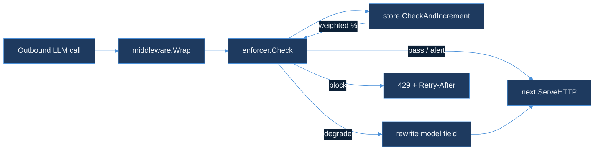

# cost-budget-enforcer

`cost-budget-enforcer` is RouteIQ's second module (after `semantic-cache-engine`): HTTP middleware that sits in front of an outbound LLM call and caps how much a tenant can spend on tokens inside a rolling daily window. Full design — the sliding-window counter, the three-threshold alert/soft/hard split, graceful degradation to a cheaper model, and the debounced webhook contract — is in [`DESIGN.md`](DESIGN.md).

**Status: Day 65 shipped the design. Day 66 implements it — `pkg/store`'s Redis-backed weighted counter, `pkg/enforcer`'s threshold decision, and `pkg/middleware`'s `net/http` wrapper.**

## Quickstart

```bash
go test ./...
```

Tests run against [`miniredis`](https://github.com/alicebob/miniredis) — an in-process Redis with a real Lua interpreter — so `pkg/store`'s `EVAL`'d script (DESIGN.md §1) is exercised exactly as it runs in production, without a live Redis daemon.

## How the pieces fit



- **`pkg/store`** — the tenant budget counter. `RedisStore.CheckAndIncrement` runs DESIGN.md §1's Lua script against Redis, refined to compute window membership as `floor(now / window_seconds)` instead of a stored `window_start` timestamp, so an 86400-second window always rolls over exactly at UTC midnight rather than drifting to whenever a request happens to arrive after expiry. `MarkAlerted` implements §4's `SETNX`-based debounce.
- **`pkg/config`** — per-tenant budget, window, fallback model, and threshold configuration, loaded from a JSON file with a `default` entry and a `tenants` override map (same shape `semantic-cache-engine/pkg/config` uses).
- **`pkg/enforcer`** — maps a weighted token count to one of `Pass` / `Alert` / `Degrade` / `Block` per DESIGN.md §2's thresholds (80% / 100% / 120% of budget by default), and fires the alert webhook (§4) exactly once per tenant per window.
- **`pkg/middleware`** — `net/http` middleware: `Block` returns `429` with `Retry-After`; `Degrade` rewrites the JSON body's `model` field to the tenant's configured fallback before forwarding; `Pass`/`Alert` forward unmodified. A Redis error fails open (forwards unmodified) rather than taking down the request path it's guarding — the same choice `ingestion/src/rate_limit/token_bucket.rs` makes.

## Wiring it up

```go
rdb := redis.NewClient(&redis.Options{Addr: "localhost:6379"})
cfg, _ := config.Load("budgets.json")

enf := &enforcer.Enforcer{
    Store:   store.NewRedisStore(rdb),
    Webhook: myWebhookSender{},
}

mw := &middleware.Middleware{
    Enforcer: enf,
    Tenant:   func(r *http.Request) string { return r.Header.Get("X-Tenant-Id") },
    Tokens:   estimateTokensFromBody,
    Config:   func(tenantID string) config.TenantConfig { return cfg.ForTenant(tenantID) },
}

http.Handle("/v1/chat/completions", mw.Wrap(llmProxyHandler))
```

## Out of scope (Day 66)

No live Redis instance exercised outside `miniredis` (no Docker daemon in this build environment, the same constraint Day 65's `DESIGN.md` logged). No tenant-facing UI for `alert_webhook_url` configuration — still deferred per `DESIGN.md`'s Day 65 scope note. Per-tenant threshold overrides are supported by `pkg/config` but not yet exercised by any caller.
