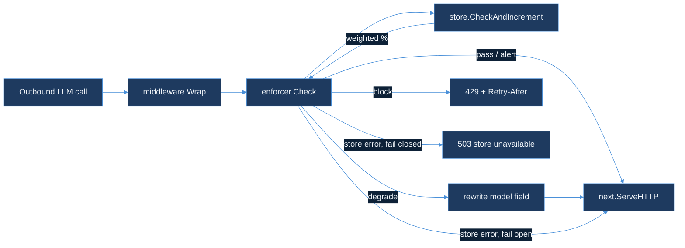

# cost-budget-enforcer

`cost-budget-enforcer` is RouteIQ's second module (after `semantic-cache-engine`): HTTP middleware that sits in front of an outbound LLM call and caps how much a tenant can spend on tokens inside a rolling daily window. Full design — the sliding-window counter, the three-threshold alert/soft/hard split, graceful degradation to a cheaper model, and the debounced webhook contract — is in [`DESIGN.md`](DESIGN.md).

**Status: Day 65 shipped the design. Day 66 implemented the enforcement path — `pkg/store`'s Redis-backed weighted counter, `pkg/enforcer`'s threshold decision, and `pkg/middleware`'s `net/http` wrapper. Day 67 adds the Admin API — `pkg/admin`'s `PATCH /tenants/{id}/budget` and `pkg/audit`'s Kafka-backed audit trail — so a tenant's budget can change without a config-file edit and a restart. Day 68 adds `pkg/gateway`'s RouteIQ stub gateway — enforcer, then semantic cache, then model, in that order — and `pkg/lensai`'s dual-write of real spend onto LensAI's `cost_usd` stream. Day 69 adds `config.TenantConfig.FailClosed`: an opt-in per-tenant override that rejects requests with `503` instead of forwarding them unmetered when the budget Store is unreachable, plus chaos tests and a benchmark of what each policy costs.**

## Quickstart

```bash
go test ./...
```

Tests run against [`miniredis`](https://github.com/alicebob/miniredis) — an in-process Redis with a real Lua interpreter — so `pkg/store`'s `EVAL`'d script (DESIGN.md §1) is exercised exactly as it runs in production, without a live Redis daemon.

## How the pieces fit



- **`pkg/store`** — the tenant budget counter. `RedisStore.CheckAndIncrement` runs DESIGN.md §1's Lua script against Redis, refined to compute window membership as `floor(now / window_seconds)` instead of a stored `window_start` timestamp, so an 86400-second window always rolls over exactly at UTC midnight rather than drifting to whenever a request happens to arrive after expiry. `MarkAlerted` implements §4's `SETNX`-based debounce.
- **`pkg/config`** — per-tenant budget, window, fallback model, and threshold configuration, loaded from a JSON file with a `default` entry and a `tenants` override map (same shape `semantic-cache-engine/pkg/config` uses). `FailClosed` (Day 69) opts a tenant out of the default fail-open Redis-outage policy.
- **`pkg/enforcer`** — maps a weighted token count to one of `Pass` / `Alert` / `Degrade` / `Block` per DESIGN.md §2's thresholds (80% / 100% / 120% of budget by default), and fires the alert webhook (§4) exactly once per tenant per window.
- **`pkg/middleware`** — `net/http` middleware: `Block` returns `429` with `Retry-After`; `Degrade` rewrites the JSON body's `model` field to the tenant's configured fallback before forwarding; `Pass`/`Alert` forward unmodified. A Redis error fails open (forwards unmodified) by default — the same choice `ingestion/src/rate_limit/token_bucket.rs` makes — or fails closed (`503`) when the tenant's `FailClosed` is set (DESIGN.md §7).

## Wiring it up

```go
rdb := redis.NewClient(&redis.Options{Addr: "localhost:6379"})
cfg, _ := config.Load("budgets.json")

enf := &enforcer.Enforcer{
    Store:   store.NewRedisStore(rdb),
    Webhook: myWebhookSender{},
}

mw := &middleware.Middleware{
    Enforcer: enf,
    Tenant:   func(r *http.Request) string { return r.Header.Get("X-Tenant-Id") },
    Tokens:   estimateTokensFromBody,
    Config:   func(tenantID string) config.TenantConfig { return cfg.ForTenant(tenantID) },
}

http.Handle("/v1/chat/completions", mw.Wrap(llmProxyHandler))
```

## Admin API (Day 67)

`pkg/admin.Handler` serves one route, `PATCH /tenants/{id}/budget`, that patches any subset of a tenant's `config.TenantConfig` fields in place on a `config.LiveStore` — the mutable counterpart to the static `config.Config` `Load` returns — without restarting the process that owns the `enforcer.Enforcer` reading it.

```bash
curl -X PATCH http://localhost:8080/tenants/acme/budget \
  -H 'X-Admin-Actor: akshant@example.test' \
  -H 'Content-Type: application/json' \
  -d '{"budget_tokens": 5000000}'
```

Every field in the request body is optional — omitted fields keep their current value, so a caller changing only `budget_tokens` cannot accidentally reset `fallback_model` to empty. The merged result is validated (`TenantConfig.Validate`: positive budget, positive window, `0 < alert < soft < hard`) before it's committed; an invalid patch is rejected with `422` and the store is left untouched.

**Audit-first, not audit-eventually.** Every applied patch is published to `pkg/audit` (topic `cost_budget_audit_log`, keyed by tenant ID) *before* the handler responds `200`. If that publish fails, the handler rolls the in-memory change back with `LiveStore.Set` and responds `503` — the opposite of `pkg/middleware`'s fail-open choice on a Redis error. The two failures aren't symmetric: a lost per-request budget check costs one over-permissive request that the next request corrects; a budget change nobody can prove happened is a compliance gap with no way to reconstruct it after the fact. Fail-open protects the request path; fail-closed protects the record.

```go
store := config.NewLiveStore(cfg) // cfg from config.Load, same as before
kafkaPub := audit.NewKafkaPublisher([]string{"localhost:9092"})
defer kafkaPub.Close()

adminHandler := &admin.Handler{Store: store, Audit: kafkaPub}
http.Handle("/tenants/", adminHandler)

// enforcer.Enforcer and middleware.Middleware now read live values:
mw := &middleware.Middleware{
    Enforcer: enf,
    Config:   func(tenantID string) config.TenantConfig { return store.ForTenant(tenantID) },
    // ...
}
```

## Stub gateway (Day 68)

`pkg/gateway.Gateway.Handle` composes the pieces above into RouteIQ's actual request order — budget check, then cache lookup, then model call — and dual-writes each outcome to LensAI via `pkg/lensai.Writer`. `cmd/stubgateway` runs it end to end against an in-process Redis and a fixed price-table model, reading requests from a JSON Lines file:

```bash
cat >/tmp/requests.jsonl <<'EOF'
{"tenant_id": "acme", "model": "gpt-4o", "prompt": "summarize this ticket"}
EOF
go run ./cmd/stubgateway --input /tmp/requests.jsonl --budget-tokens 5000
# tenant=acme action=inference model=gpt-4o degraded=false tokens=8 cost_usd=0.0002
```

A request that crosses the tenant's hard limit never reaches the cache or the model — see DESIGN.md §6 for why that ordering, not just the resulting status code, is the point. Pass `--lensai-url` to also dual-write each outcome (`gateway_inference`, `gateway_cache_hit`, or `gateway_blocked`) to a real ingest endpoint.

## Redis outage policy (Day 69)

By default, both `pkg/middleware.Wrap` and `pkg/gateway.Handle` fail open when the budget `Store` is unreachable: the request is forwarded (or reaches `Cache`/`Model`) unmetered rather than rejected. Set `fail_closed: true` on a tenant's config to flip that:

```json
{"tenants": {"strict-tenant": {"budget_tokens": 5000000, "fallback_model": "gpt-4o-mini", "fail_closed": true}}}
```

`strict-tenant`'s requests now get `503 {"error":"budget store unavailable","policy":"fail_closed"}` (HTTP) or `Result{StoreUnavailable: true}` (gateway) instead of being forwarded during an outage. See [DESIGN.md §7](DESIGN.md#7-redis-outage-policy--fail-open-by-default-fail-closed-per-tenant-day-69) for why this is per-tenant rather than a repo-wide flag, and [BENCHMARKS.md](BENCHMARKS.md) for what each policy actually costs per request (fail-closed is the *cheaper* path, not the expensive one — the trade is availability, not latency).

## Out of scope

**Day 66.** No live Redis instance exercised outside `miniredis` (no Docker daemon in this build environment, the same constraint Day 65's `DESIGN.md` logged). No tenant-facing UI for `alert_webhook_url` configuration — still deferred per `DESIGN.md`'s Day 65 scope note.

**Day 67.** No live Kafka broker in this build environment (same constraint as Redis above) — `pkg/audit.KafkaPublisher` is exercised against an unreachable address to confirm its error path, not against a real cluster; `TestBudgetChangeEventRoundTrips` covers the wire format independently. No authentication/authorization on the Admin API itself — `X-Admin-Actor` is trusted as given, recorded for the audit trail, and not verified; a network-boundary auth layer (mTLS, an API gateway) is assumed to sit in front of this handler in any real deployment, the same assumption the rest of this repo's internal-facing endpoints make. No bulk/multi-tenant patch endpoint — one tenant per request, matching the path shape.

**Day 68.** No real `CacheClient`/`ModelClient` — `cmd/stubgateway` uses an always-miss cache and a fixed price table, not a wired `semantic-cache-engine` client or a real model provider. No cross-module import from `cost-budget-enforcer` to `semantic-cache-engine`; the two stay separate Go modules for now (DESIGN.md §6). No live Redis or LensAI endpoint in this sandbox — `cmd/stubgateway` runs against an in-process `miniredis` and skips LensAI emission unless `--lensai-url` is set.

**Day 69.** No change to `enforcer.Check`'s error contract — only the two callers that already handled its error gained a `FailClosed` branch. No metrics/counter for fail-closed rejections (this module has no metrics client wired in anywhere yet). No live-Redis-over-network benchmark — `BENCHMARKS.md` is loopback `miniredis` only (no Docker daemon in this sandbox).
