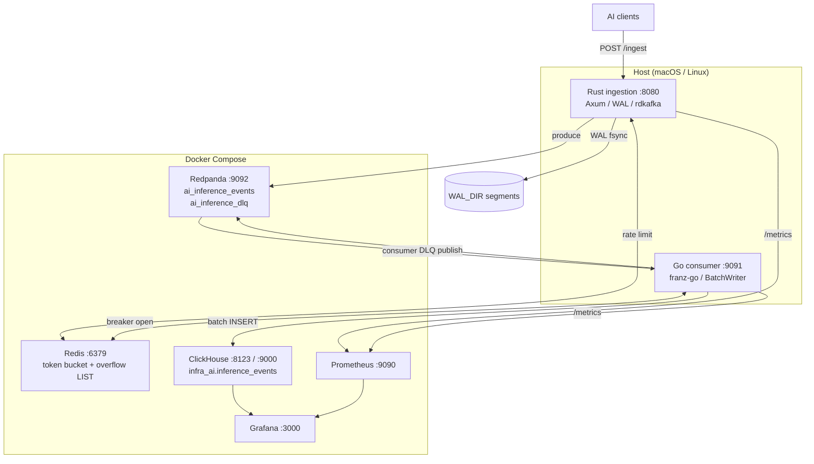
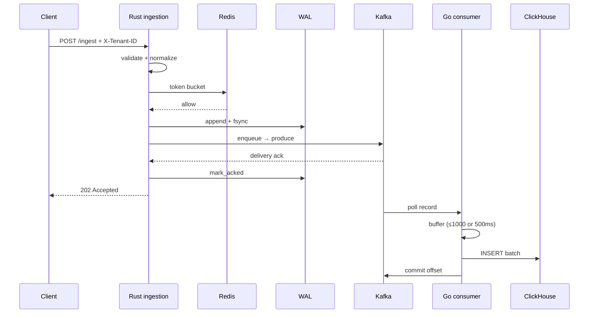
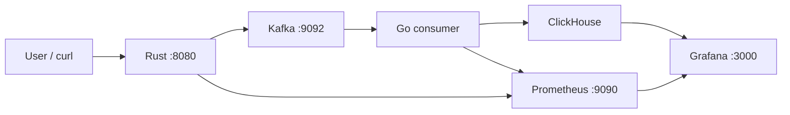
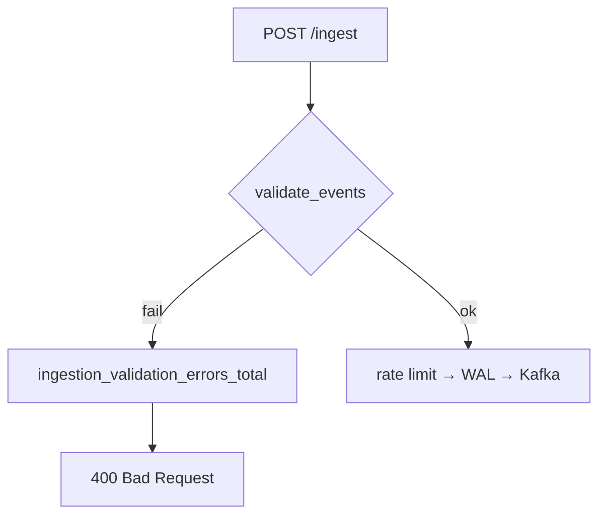
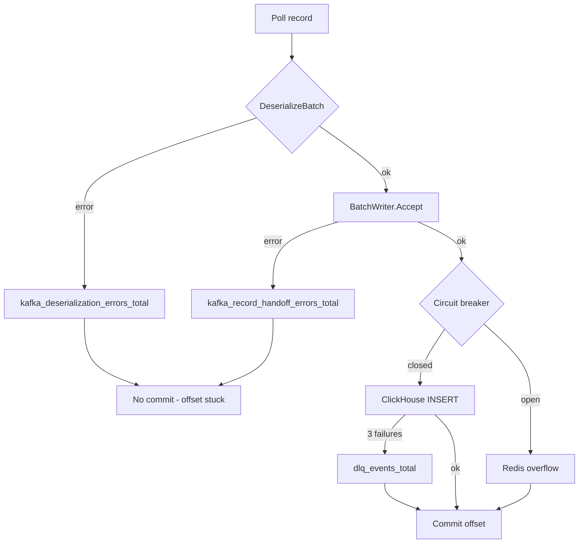

# Architecture, flows, and observability — infra-ai-streaming

Canonical reference for the **Rust ingest → Kafka → Go consumer → ClickHouse** pipeline, local runtime, event lifecycles, and Grafana/Prometheus mapping. Complements [DESIGN.md](../DESIGN.md) (CAP and failure matrix), [END-TO-END-FLOWS.md](END-TO-END-FLOWS.md) (runnable demos), and [OBSERVABILITY.md](../OBSERVABILITY.md) (metric catalog).

---

## Table of contents

1. [Architecture and design](#1-architecture-and-design)
2. [Implementation status](#2-implementation-status)
3. [Code walkthrough](#3-code-walkthrough)
4. [Local runtime and Docker](#4-local-runtime-and-docker)
5. [End-to-end event lifecycle](#5-end-to-end-event-lifecycle)
6. [Observability matrix](#6-observability-matrix)
7. [Gap analysis and fixes](#7-gap-analysis-and-fixes)
8. [Troubleshooting](#8-troubleshooting)

---

## 1. Architecture and design

### 1.1 Component diagram

### 1.2 Request flow (happy path)

### 1.3 Deployment: Docker vs host

| Layer | Runs in Docker | Runs on host | Why |
|-------|----------------|--------------|-----|
| Redis, Redpanda, ClickHouse | Yes | Optional native | One-command deps; pinned images |
| Prometheus, Grafana | Yes | — | Scrape `host.docker.internal` for app metrics |
| Rust `ingestion` binary | — | **Yes** (typical) | `rdkafka` + WAL paths; fast rebuild loop |
| Go `consumer` binary | — | **Yes** (typical) | Same; connects to `127.0.0.1:9092` |
| Init jobs | Yes (one-shot) | — | `redpanda-init`, `clickhouse-init` |

**Network:** From containers, apps on the host are reached via `host.docker.internal` (Prometheus scrape config). From host binaries, Kafka is `127.0.0.1:9092` (published from Redpanda external listener).

### 1.4 Design rationale

| Decision | Rationale |
|----------|-----------|
| **AP at ingest edge** | Accept quickly: WAL + Kafka before ClickHouse. Clients get bounded latency; analytics are **eventually consistent**. |
| **ClickHouse eventual consistency** | Batch writer (1000 events / 500ms) amortizes inserts; breaker prevents hammering CH when unhealthy. |
| **Partition key `tenant_id`** | Per-tenant ordering in Kafka; matches rate-limit boundary. DESIGN target `hash(tenant_id:model_id)` is **not** implemented yet. |
| **Circuit breaker** | 5 consecutive insert failures → **open**; skip CH, push to Redis overflow. 30s → half-open; 1 success → closed. |
| **Redis overflow** | LIST `ai_inference:overflow` (configurable); drain 5s / 5000 events when breaker closed. Offsets still commit after overflow handoff. |
| **DLQ** | After 3 insert retries per batch, per-event publish to `ai_inference_dlq` (Go). Ingest-side produce failure also routes to DLQ topic (Rust). |
| **Manual Kafka commits** | Offsets advance only after CH insert, overflow push, or DLQ publish — poison JSON does not commit. |
| **WAL before channel** | Durability if process dies between accept and Kafka ack; replay on startup. |
| **Fail-open rate limit** | Redis errors allow ingest (availability over strict quota). |

---

## 2. Implementation status

Feature completeness by component (all paths on `main` unless noted).

| Feature | Status | Primary paths |
|---------|--------|---------------|
| Rust HTTP ingestion (validate, rate limit, WAL, Kafka) | **Completed** | `ingestion/src/handlers/ingest.rs`, `wal/writer.rs`, `kafka/producer.rs` |
| Local deploy stack (Compose, topics, DDL, Prometheus) | **Completed** | `deploy/docker-compose.yml`, `redpanda/init-topics.sh`, `clickhouse/init.sql` |
| Go consumer → ClickHouse (batch, breaker, overflow, DLQ) | **Completed** | `consumer/internal/clickhouse/writer.go`, `kafka/reader.go` |
| Local E2E Grafana dashboard | **Completed** | `deploy/grafana/.../ai-inference-e2e.json` (UID `ai-inference-e2e-local`) |
| Product SLO dashboard + consumer lag metric | **Completed** | `dashboards/ai-inference-product.json`, `consumer/internal/kafka/reader.go` |
| Helm + k3d + consumer HPA on Kafka lag | **Completed** | `deploy/helm/lensai/`, `deploy/k3d/cluster.yaml` |
| Z-score anomaly detection + `ai_anomalies` topic | **Completed** | `consumer/internal/anomaly/` |

### Backlog

| Item | Status |
|------|--------|
| `hash(tenant_id:model_id)` partition key | Pending |
| k6 load test in CI, published benchmark numbers | Pending |
| OTLP export wired in compose | Partial (env stub only) |

---

## 3. Code walkthrough

### 3.1 Ingestion (`ingestion/`)

| Concern | File | Lines (approx.) | Behavior |
|---------|------|-----------------|----------|
| Binary bootstrap | `src/main.rs` | 16–81 | Config, WAL replay → channel, Kafka worker task, `server::serve` |
| HTTP router | `src/server.rs` | 24–51 | `/ingest`, `/health`, `/metrics`; 30s timeout; concurrency cap |
| Ingest handler | `src/handlers/ingest.rs` | 178–335 | Validate → rate limit → WAL → `try_send` → 202 |
| Validation enum | `src/handlers/ingest.rs` | 66–100 | `ValidationError` → 400 + `ingestion_validation_errors_total` |
| WAL | `src/wal/writer.rs` | 14–21, 150+ | Segment append, fsync, `mark_acked`, replay |
| Kafka producer | `src/kafka/producer.rs` | 54–130 | Idempotent produce; DLQ on max retries; WAL ack on success |
| Rate limit | `src/rate_limit/token_bucket.rs` | 36+ | Redis Lua bucket; fail-open |
| Metrics | `src/metrics.rs` | 10–65 | Prometheus registry for ingest path |

**Backpressure:** `try_send` on bounded `mpsc` (`BATCH_CHANNEL_CAPACITY`, default 10000) → 503 + `backpressure_events_total` (`ingest.rs` ~295–307).

### 3.2 Consumer (`consumer/`)

| Concern | File | Lines (approx.) | Behavior |
|---------|------|-----------------|----------|
| Main wiring | `cmd/consumer/main.go` | 17–54 | Overflow, DLQ, BatchWriter, Reader, metrics HTTP |
| Kafka reader | `internal/kafka/reader.go` | 60–148 | Poll, deserialize, `Accept`, manual commit, lag gauges |
| Batch writer | `internal/clickhouse/writer.go` | 106–227 | Buffer, flush ticker, handoff CH / overflow / DLQ |
| Circuit breaker | `internal/clickhouse/breaker.go` | — | 5 fail / 30s reset |
| Overflow | `internal/redis/overflow.go` | 58+ | LPUSH / RPOP; updates `redis_overflow_depth` |
| DLQ | `internal/kafka/dlq.go` | — | Per-event JSON to DLQ topic |
| Metrics | `internal/metrics/metrics.go` | — | consumer metric set |
| Metrics HTTP | `internal/metrics/server.go` | — | Default port **9091** |

**Critical handoff path:** `reader.handleRecord` → `writer.Accept` (blocks on handoff completion) → `Flush` / `handoffEvents` → insert or overflow or DLQ → `signalHandoffSignals` → reader commits.

### 3.3 Deploy (`deploy/`)

| Asset | Role |
|-------|------|
| `docker-compose.yml` | Redis, Redpanda, ClickHouse, Prometheus, Grafana + init jobs |
| `prometheus/prometheus.yml` | Scrapes `host.docker.internal:8080` and `:9091` |
| `grafana/provisioning/` | Datasources + dashboards (e2e + product) |
| `clickhouse/init.sql` | `infra_ai.inference_events` MergeTree DDL |
| `redpanda/init-topics.sh` | `ai_inference_events`, `ai_inference_dlq` |

---

## 4. Local runtime and Docker

### 4.1 Startup sequence

1. `cp deploy/.env.example deploy/.env`
2. `docker compose --env-file deploy/.env -f deploy/docker-compose.yml up -d`
3. Wait: Redis, Redpanda, ClickHouse healthy; init jobs exited 0
4. Terminal A: `cd consumer && set -a && source ../deploy/.env && set +a && go run ./cmd/consumer`
5. Terminal B: `set -a && source deploy/.env && set +a && cargo run -p ingestion`
6. Verify: http://localhost:9090/targets (both jobs UP), Grafana dashboards

### 4.2 Ports

| Service | Port(s) | Protocol |
|---------|---------|----------|
| Rust ingestion | 8080 | HTTP (`/ingest`, `/health`, `/metrics`) |
| Go consumer metrics | 9091 | HTTP `/metrics` |
| Redis | 6379 | Redis |
| Redpanda Kafka | 9092 (host) → 19092 (container) | Kafka |
| Redpanda admin | 9644 | HTTP |
| ClickHouse HTTP | 8123 | HTTP |
| ClickHouse native | 9000 | TCP |
| Prometheus | 9090 | HTTP |
| Grafana | 3000 | HTTP (`admin` / `admin`) |

### 4.3 Runtime diagram

### 4.4 Dependencies

- **Ingestion:** Redis (rate limit), Kafka (produce), writable `WAL_DIR`
- **Consumer:** Kafka (consume), ClickHouse (insert), Redis (overflow), Kafka (DLQ produce)
- **Prometheus:** Host binaries listening on 8080 and 9091

---

## 5. End-to-end event lifecycle

### 5.1 Path catalog

| Category | Trigger | HTTP / Kafka | Handoff | Offset commit | Primary signals |
|----------|---------|--------------|---------|---------------|-----------------|
| **Happy** | Valid POST | 202 → topic | CH INSERT | Yes | `ingestion_latency_ms`, `kafka_records_processed_total` |
| **Validation** | Bad schema | 400, no WAL | — | N/A | `ingestion_validation_errors_total{error}` |
| **Missing header** | No `X-Tenant-ID` | 400 | — | N/A | logs only |
| **Rate limit** | Bucket empty | 429 | — | N/A | `rate_limited_requests_total` |
| **Backpressure** | Channel full | 503 | — | N/A | `backpressure_events_total` |
| **WAL failure** | Disk error | 503 | — | N/A | logs `wal append failed` |
| **Kafka produce fail** | Broker down | WAL unacked | Rust DLQ attempt | N/A | `kafka_produce_errors_total` |
| **Parse (consumer)** | Garbage on topic | — | None | **No** | `kafka_deserialization_errors_total`, `record_failed` log |
| **Processing fail** | `Accept` error | — | None | **No** | `kafka_record_handoff_errors_total` |
| **CH retry** | Transient CH error | — | Retry ×3 | After overflow/DLQ | `clickhouse_write_errors_total` |
| **Breaker open** | 5 CH failures | — | Redis overflow | Yes | `circuit_breaker_state{open}`, `redis_overflow_depth` |
| **DLQ** | 3 insert failures | — | DLQ topic | Yes | `dlq_events_total` |
| **Timeout (event field)** | `status: timeout` in JSON | 202 (valid) | CH row with status | Yes | CH panel P99 / status dimension |
| **Duplicate** | Reconsume / replay | — | Second INSERT | Possible | Same `event_id` if client supplied; at-least-once |
| **Partial batch** | Multi-event record | — | All-or-nothing per multi-event record | Per record | `clickhouse_batch_size` |
| **Recovery** | Restart ingestion | WAL replay | Re-produce unacked | N/A | `wal_replay_events_total`, `wal_segments_pending` |
| **Unexpected** | Panic / OOM | — | Undefined | Maybe stuck | `up{job=...}`, logs |

### 5.2 Mermaid: validation path

### 5.3 Mermaid: consumer failure paths

### 5.4 Runnable demos

See [END-TO-END-FLOWS.md](END-TO-END-FLOWS.md) and `./scripts/demo-flows.sh` for commands: `happy-path`, `validation-error`, `circuit-breaker`, `dlq-path`, `invalid-json`, `rate-limit`, `burst`, `timeout-event`, `metrics-snapshot`.

---

## 6. Observability matrix

Scrape: ingestion `:8080/metrics`, consumer `:9091/metrics`. Dashboards: **Product SLOs** (`ai-inference-product`), **Local E2E** (`ai-inference-e2e-local`).

### 6.1 Ingestion metrics (both dashboards where applicable)

| Event Type | Status | Metric Name | Labels | Dashboard Panel | Source File |
|------------|--------|-------------|--------|-----------------|-------------|
| Happy ingest | Emitted | `ingestion_latency_ms` | `tenant_id`, `status` | Ingest request rate; Ingestion latency (e2e) | `ingestion/src/metrics.rs`, observed `handlers/ingest.rs:319-321` |
| Happy ingest | Emitted | `batch_size_events` | `tenant_id` | Batch size; Ingest throughput by tenant (product) | `metrics.rs`, `ingest.rs:322-324` |
| Rate limited | Emitted | `rate_limited_requests_total` | `tenant_id` | Errors & rejections (e2e) | `metrics.rs`, `rate_limit/token_bucket.rs:95-96` |
| Backpressure | Emitted | `backpressure_events_total` | — | Errors & rejections (e2e) | `metrics.rs`, `ingest.rs:298` |
| Validation error | Emitted | `ingestion_validation_errors_total` | `error` | Errors & rejections (e2e) | `metrics.rs`, `ingest.rs` `ValidationError::into_response` |
| Kafka produce fail | Emitted | `kafka_produce_errors_total` | `tenant_id`, `error_type` | Errors & rejections (e2e) | `kafka/producer.rs:114-116` |
| WAL backlog | Emitted | `wal_segments_pending` | — | WAL segments pending (e2e) | `wal/writer.rs:153,183` |
| WAL replay | Emitted | `wal_replay_events_total` | — | WAL replay (e2e) | `wal/writer.rs:258` |
| Scrape health | Emitted | `up{job="ingestion"}` | — | Ingestion scrape UP (e2e) | Prometheus |

### 6.2 Consumer metrics

| Event Type | Status | Metric Name | Labels | Dashboard Panel | Source File |
|------------|--------|-------------|--------|-----------------|-------------|
| Handoff complete | Emitted | `kafka_records_processed_total` | — | Kafka handoff rate (e2e) | `kafka/reader.go:146` |
| Deserialize fail | Emitted | `kafka_deserialization_errors_total` | — | (add panel: Errors & rejections) | `kafka/reader.go`, `metrics/metrics.go` |
| Handoff fail | Emitted | `kafka_record_handoff_errors_total` | — | (logs + metric; panel optional) | `kafka/reader.go`, `metrics/metrics.go` |
| CH insert fail | Emitted | `clickhouse_write_errors_total` | — | (via flush errors) | `clickhouse/writer.go:217` |
| CH batch ok | Emitted | `clickhouse_batch_size` | — | (histogram) | `writer.go:212` |
| CH flush timing | Emitted | `clickhouse_flush_duration_seconds` | — | ClickHouse flush p99 (e2e) | `writer.go:207` |
| Breaker state | Emitted | `circuit_breaker_state` | `state` | Circuit breaker OPEN (e2e) | `metrics.go` `SetBreakerState`, `writer.go` |
| Overflow depth | Emitted | `redis_overflow_depth` | — | Overflow depth / DLQ (e2e) | `redis/overflow.go:98` |
| DLQ publish | Emitted | `dlq_events_total` | — | Overflow depth / DLQ (e2e) | `writer.go` via DLQ publisher |
| Consumer lag | Emitted | `kafka_consumer_lag_events` | `topic`, `partition`, `group` | Kafka consumer lag (product + e2e if added) | `kafka/reader.go:106-135` |
| Scrape health | Emitted | `up{job="consumer"}` | — | Consumer scrape UP (e2e) | Prometheus |

### 6.3 ClickHouse-backed panels (product dashboard only)

| Event Type | Status | Metric / query | Labels | Dashboard Panel | Source |
|------------|--------|----------------|--------|-----------------|--------|
| Inference P99 | Query | `quantile(0.99)(latency_ms)` by `model_id` | `model_id` | P99 inference latency by model | `dashboards/ai-inference-product.json` → `infra_ai.inference_events` |
| Cost rollup | Query | `sum(cost_usd)` by hour, `tenant_id` | `tenant_id` | Cost per hour by tenant | same |
| Row count sanity | Query | `SELECT count(), max(cost_usd) ...` | — | ClickHouse inference_events (e2e) | `ai-inference-e2e.json` |

Full PromQL and SLO sketches: [OBSERVABILITY.md](../OBSERVABILITY.md).

---

## 7. Gap analysis and fixes

| Gap | Severity | Fix (this branch) |
|-----|----------|-------------------|
| Validation 400s had no Prometheus counter | Medium | Added `ingestion_validation_errors_total{error}` |
| Consumer deserialize failures only logged | Medium | Added `kafka_deserialization_errors_total` |
| Consumer `Accept` failures only logged | Low | Added `kafka_record_handoff_errors_total` |
| Product dashboard on `main` | Doc | Documented in §2; merge feature branch |
| `hash(tenant_id:model_id)` partition key | Design | Documented pending; no code change |
| Anomaly metrics in 7-day plan | Backlog | Not implemented (non-goal for v0) |

Tests: `go test ./...` (consumer), `cargo test -p ingestion` (ingestion).

---

## 8. Troubleshooting

| Symptom | Likely cause | What to check |
|---------|--------------|---------------|
| `up{job="ingestion"}==0` | Binary not running or wrong port | `curl localhost:8080/health`; Prometheus targets |
| `up{job="consumer"}==0` | Consumer not on 9091 | `go run ./cmd/consumer`; `METRICS_PORT` |
| Ingest 503 `wal_failure` | `WAL_DIR` not writable | Permissions, disk space |
| Ingest 503 `backpressure` | Kafka worker stalled | Redpanda up; channel capacity |
| Consumer lag rising | Slow CH or stopped consumer | `kafka_consumer_lag_events`; CH health |
| Breaker stuck open | ClickHouse down | `docker compose start clickhouse` |
| Overflow not draining | Breaker not closed | Fix CH; wait 5s drain tick |
| Partition stuck | Poison JSON on topic | `kafka_deserialization_errors_total`; skip offset manually |
| Product CH panels empty | Datasource host | `datasources.yml` `jsonData.host: clickhouse`; restart Grafana |
| Duplicate rows in CH | At-least-once + replay | Expected without ReplacingMergeTree dedup |

**Scripts:** `./scripts/smoke-e2e.sh`, `./scripts/demo-flows.sh <command>`

**See also:** [END-TO-END-FLOWS.md](END-TO-END-FLOWS.md) · [PROJECT-STATUS.md](PROJECT-STATUS.md) · [deploy/README.md](../deploy/README.md)

---

*Footer: The [Profile](https://github.com/AkshantVats/Profile) repository is a separate static portfolio site and is **not** part of this Docker Compose stack.*
