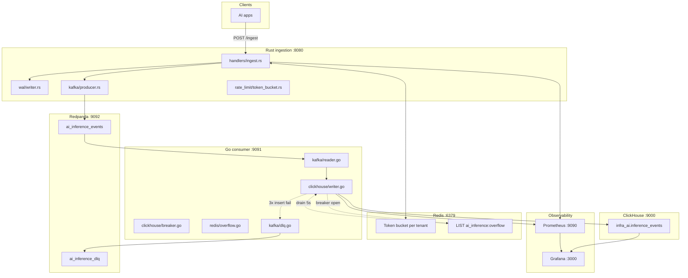
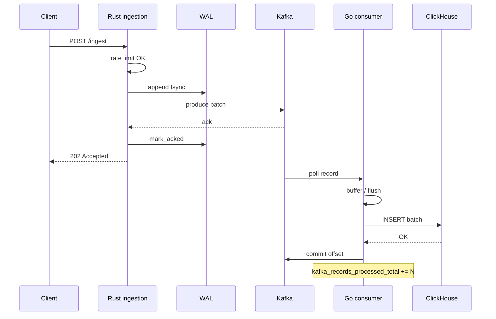
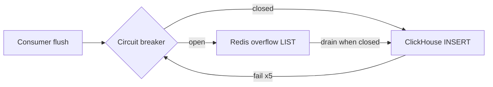

# End-to-end flows — infra-ai-streaming (Days 0–5)

Onboarding guide for the local pipeline: **HTTP ingest (Rust) → WAL → Kafka → Go consumer → ClickHouse**, with **Redis** (rate limits + overflow), **DLQ**, and **Prometheus/Grafana** proof. Metric names match code; dashboard UIDs: **`ai-inference-e2e-local`**, **`ai-inference-product`**.

**Full architecture, lifecycle tables, and observability matrix:** [ARCHITECTURE-AND-FLOWS.md](ARCHITECTURE-AND-FLOWS.md).

Related: [OBSERVABILITY.md](../OBSERVABILITY.md) (metric catalog, SLO sketches), [DESIGN.md](../DESIGN.md) (CAP, backpressure, failure matrix), [PROJECT-STATUS.md](PROJECT-STATUS.md) (what ships today).

---

## Table of contents

1. [Timeline: Days 0–5](#timeline-days-05)
2. [Architecture and file map](#architecture-and-file-map)
3. [Happy path (E2E)](#happy-path-e2e)
4. [Failure and edge paths](#failure-and-edge-paths)
5. [Kafka offset commit policy](#kafka-offset-commit-policy)
6. [Grafana dashboard guide](#grafana-dashboard-guide)
7. [Watch the flow live (3 terminals)](#watch-the-flow-live-3-terminals)
8. [Runnable scenarios](#runnable-scenarios)

---

## Timeline: Days 0–5

| Day | Milestone | What landed |
|-----|-----------|-------------|
| **0** | Repo bootstrap | Layout in [docs/7-day-plan.md](7-day-plan.md), MIT license, CI skeleton |
| **1** | Design + README | [DESIGN.md](../DESIGN.md) (CAP, partitions, backpressure, failure modes), [README.md](../README.md) architecture narrative |
| **2** | Rust ingestion (part 1) | `ingestion/` crate: config, metrics registry, WAL writer, rate-limit primitives, validation tests |
| **3** | Rust ingestion (part 2) | Runnable **Axum** binary: `POST /ingest`, WAL-before-channel, **rdkafka** producer, DLQ on produce failure, `GET /metrics` |
| **4** | Deploy stack + consumer skeleton | [deploy/docker-compose.yml](../deploy/docker-compose.yml): Redis, Redpanda, ClickHouse, Prometheus, Grafana; topics via `redpanda-init`; DDL via `clickhouse-init`; Go **franz-go** reader (stdout / handoff wiring) |
| **5** | ClickHouse writer (G-03) | **BatchWriter** (1000 events or 500ms), **circuit breaker**, **Redis LIST overflow**, **DLQ** after 3 insert retries, consumer Prometheus on `:9091`, Grafana dashboard **`ai-inference-e2e-local`**, [OBSERVABILITY.md](../OBSERVABILITY.md) |

Current feature branch reference: `feat/consumer-clickhouse-batch-writer` (Day 5 consumer path).

---

## Architecture and file map



### Rust ingestion (`ingestion/`)

| Component | Path | Role |
|-----------|------|------|
| Binary entry | `ingestion/src/main.rs` | Loads config, WAL replay, Kafka worker, HTTP server |
| HTTP server | `ingestion/src/server.rs` | Axum routes: `/health`, `/metrics`, `/ingest` |
| Ingest handler | `ingestion/src/handlers/ingest.rs` | Validate → rate limit → WAL append → `mpsc` enqueue |
| Config | `ingestion/src/config.rs` | Env: `KAFKA_*`, `WAL_DIR`, `RATE_LIMIT_*`, `BATCH_CHANNEL_CAPACITY` |
| WAL | `ingestion/src/wal/writer.rs` | Segment files, `mark_acked` after Kafka delivery |
| Kafka producer | `ingestion/src/kafka/producer.rs` | JSON envelope `{"events":[...]}`, partition key `tenant_id` |
| Rate limit | `ingestion/src/rate_limit/token_bucket.rs` | Redis token bucket; **fail-open** on Redis errors |
| Metrics | `ingestion/src/metrics.rs` | Prometheus histograms/counters for ingest path |

### Go consumer (`consumer/`)

| Component | Path | Role |
|-----------|------|------|
| Main | `consumer/cmd/consumer/main.go` | Wire overflow, DLQ, BatchWriter, Kafka reader, metrics HTTP |
| Config | `consumer/internal/config/config.go` | Batch size, flush interval, breaker thresholds, DSN |
| Kafka reader | `consumer/internal/kafka/reader.go` | Poll, deserialize, `Accept`, **manual commit** |
| DLQ publisher | `consumer/internal/kafka/dlq.go` | `ai_inference_dlq` JSON wrapper |
| Batch writer | `consumer/internal/clickhouse/writer.go` | Buffer, flush, handoff (CH / overflow / DLQ) |
| Circuit breaker | `consumer/internal/clickhouse/breaker.go` | 5 failures → open; 30s → half-open |
| Row mapping | `consumer/internal/clickhouse/row.go` | `InferenceEvent` → `infra_ai.inference_events` |
| Redis overflow | `consumer/internal/redis/overflow.go` | `LPUSH` / `RPOP`, `redis_overflow_depth` gauge |
| Event model | `consumer/internal/model/event.go` | JSON structs matching Rust envelope |
| Metrics | `consumer/internal/metrics/metrics.go` | Day 5 consumer metric set |
| Metrics HTTP | `consumer/internal/metrics/server.go` | `METRICS_PORT` (default **9091**) |

### Deploy & ops (`deploy/`)

| Asset | Path |
|-------|------|
| Compose stack | `deploy/docker-compose.yml` |
| Env template | `deploy/.env.example` → copy to `deploy/.env` |
| ClickHouse DDL | `deploy/clickhouse/init.sql` |
| Topic init | `deploy/redpanda/init-topics.sh` |
| Prometheus scrape | `deploy/prometheus/prometheus.yml` (`ingestion`, `consumer` via `host.docker.internal`) |
| Grafana dashboard | `deploy/grafana/provisioning/dashboards/ai-inference-e2e.json` |
| Datasources | `deploy/grafana/provisioning/datasources/datasources.yml` |

### Scripts

| Script | Purpose |
|--------|---------|
| `scripts/smoke-e2e.sh` | Compose up, unit tests, optional ingest → CH check |
| `scripts/demo-flows.sh` | Per-scenario demos with expected Grafana signals |

---

## Happy path (E2E)

One accepted event moves through the stack in this order:

1. **Client** `POST /ingest` with `X-Tenant-ID` and JSON `{"events":[...]}`.
2. **Validate** batch size, latency &gt; 0, non-negative `cost_usd`, timestamp freshness (`ingestion/src/handlers/ingest.rs`).
3. **Rate limit** — Redis token bucket per tenant; on deny → **429** + `Retry-After` (metric: `rate_limited_requests_total`).
4. **WAL** — append + fsync segment entry (`wal/writer.rs`).
5. **Channel** — `try_send` to bounded `mpsc`; if full → **503** + `backpressure_events_total`.
6. **Kafka worker** — produce to `ai_inference_events`; on success `mark_acked` WAL entry.
7. **Consumer** — `DeserializeBatch` → `BatchWriter.Accept` blocks until handoff completes.
8. **Batch flush** — when buffer ≥ **1000** events **or** **500ms** ticker fires.
9. **ClickHouse** — `PrepareBatch` + `Send` into `infra_ai.inference_events`.
10. **Offset commit** — record added to commit batch only after step 7’s `Accept` returns.
11. **Metrics** — `kafka_records_processed_total` += N; `clickhouse_batch_size` / `clickhouse_flush_duration_seconds` on success.



**Prove it:** `./scripts/demo-flows.sh happy-path` — see [Runnable scenarios](#runnable-scenarios).

---

## Failure and edge paths

### ClickHouse down → circuit breaker → Redis overflow

When inserts fail repeatedly:

1. Each failed flush: `clickhouse_write_errors_total++`, `RecordFailure()` on breaker.
2. After **5** consecutive failures → **open** (`circuit_breaker_state{state="open"} == 1`).
3. While open, `AllowInsert()` is false → batches **`LPUSH`** to `REDIS_OVERFLOW_KEY` (default `ai_inference:overflow`).
4. `redis_overflow_depth` tracks LIST length.
5. Kafka offsets still advance after overflow push (handoff complete).
6. Every **5s**, if breaker **closed**, drain up to **5000** events from Redis back through insert path.



**Demo:** `./scripts/demo-flows.sh circuit-breaker` (stops ClickHouse container).

### DLQ after 3 insert retries

While breaker still allows inserts (or on partial failure path):

1. `insertWithRetries` attempts batch insert **3** times (`CLICKHOUSE_INSERT_RETRIES`).
2. If all fail, **each event** is published to `ai_inference_dlq` via `DLQPublisher`.
3. `dlq_events_total` increments per event.
4. Tickets complete → offset commits (no infinite replay for that batch).

DLQ message shape (`consumer/internal/kafka/dlq.go`): `{ "event", "error", "retries", "failed_at_unix_ms" }`.

**Demo:** `./scripts/demo-flows.sh dlq-path` — may see DLQ before breaker saturates; overflow often dominates under sustained CH outage.

### Bad JSON on topic (deserialize failure)

1. `DeserializeBatch` returns error.
2. `handleRecord` logs `record_failed` — record **not** included in `CommitRecords`.
3. Offset **does not advance** → partition stalls on poison message until skipped manually.
4. `kafka_records_processed_total` does **not** increase; `kafka_deserialization_errors_total` increments.

**Demo:** `./scripts/demo-flows.sh invalid-json`.

### Rate limit (ingest)

1. Token bucket denies tenant → **429** `rate_limit_exceeded`.
2. `rate_limited_requests_total{tenant_id}` increases.
3. No WAL append for denied requests.

**Demo:** `./scripts/demo-flows.sh rate-limit` (optionally restart ingestion with `RATE_LIMIT_DEFAULT_RPS=10`).

### Backpressure (ingest)

1. Bounded `mpsc` full after WAL append attempt path uses `try_send`.
2. **503** `backpressure` + `Retry-After: 1`.
3. `backpressure_events_total` increments.

Hard to trigger at default capacity **10000**; reduce `BATCH_CHANNEL_CAPACITY` or stall Kafka worker for demos.

### High-volume burst (optional)

Parallel `POST /ingest` raises **Kafka handoff rate** and may widen **ClickHouse flush p99** — `./scripts/demo-flows.sh burst`.

---

## Kafka offset commit policy

Implementation: `consumer/internal/kafka/reader.go`.

| Rule | Behavior |
|------|----------|
| Auto-commit | **Disabled** (`kgo.DisableAutoCommit()`) |
| When commit happens | After `sink.Accept` succeeds for **all** events in the record |
| Handoff definition | ClickHouse insert **or** Redis overflow push **or** DLQ publish per event |
| Deserialize error | No commit — offset stuck |
| `Accept` error | No commit — `record_failed` logged |
| Consumer group | `KAFKA_GROUP_ID` (default `ai-inference-consumer-dev`) |
| Start offset | `AtEnd()` for local dev — new group does not replay history |

**Why:** at-least-once from Kafka’s perspective; duplicates possible if process crashes after CH write but before commit. Overflow + WAL on ingest side prevent **accepted** client data loss under stated capacity limits.

---

## Grafana dashboard guide

### Which dashboard when

| Goal | Dashboard | URL |
|------|-------------|-----|
| Debug compose, scrapes, breaker, overflow, DLQ, WAL | **Local E2E** | http://localhost:3000/d/ai-inference-e2e-local |
| Tenant/model/cost SLOs for README and product narrative | **Product SLOs** | http://localhost:3000/d/ai-inference-product |

Credentials: `admin` / `admin` (from `deploy/.env`).

---

### Product SLOs (`ai-inference-product`)

| Field | Value |
|-------|-------|
| **Title** | AI Inference — Product SLOs |
| **UID** | `ai-inference-product` |
| **URL** | http://localhost:3000/d/ai-inference-product |
| **Refresh** | 10s |
| **Canonical JSON** | `dashboards/ai-inference-product.json` |
| **Provisioned copy** | `deploy/grafana/provisioning/dashboards/ai-inference-product.json` |

#### Panel reference

| Panel | PromQL / query | Good | Bad | Proves |
|-------|----------------|------|-----|--------|
| **Ingest throughput by tenant** | `sum(rate(batch_size_events_sum[1m])) by (tenant_id)` | Series per tenant rise with traffic | Flat while posting `/ingest` | Accept path volume |
| **P99 inference latency by model** | CH: `quantile(0.99)(latency_ms)` by `model_id` | Lines per model after CH has rows | Empty — consumer down or no ingest | Warehouse `latency_ms` (not HTTP histogram) |
| **Cost per hour by tenant** | CH: `sum(cost_usd)` by `toStartOfHour(timestamp)`, `tenant_id` | Non-zero USD after billed events | Flat | Per-tenant cost accounting |
| **Kafka consumer lag** | `sum(kafka_consumer_lag_events) by (topic)` | Near 0 at steady state | Sustained &gt; 10k warning | Backlog vs consumer |

After multi-tenant ingest, open **Product SLOs** and confirm all four panels have data; use **Local E2E** if scrapes or breaker look wrong.

---

### Local E2E (`ai-inference-e2e-local`)

| Field | Value |
|-------|-------|
| **Title** | AI Inference Observability — Local E2E |
| **UID** | `ai-inference-e2e-local` |
| **URL** | http://localhost:3000/d/ai-inference-e2e-local |
| **Refresh** | 10s |
| **Source JSON** | `deploy/grafana/provisioning/dashboards/ai-inference-e2e.json` |

#### Panel reference

| Panel | PromQL / query | Good | Bad | Proves step |
|-------|----------------|------|-----|-------------|
| **Ingestion scrape UP** | `up{job="ingestion"}` | 1 (green) | 0 | Rust metrics reachable from Prometheus |
| **Consumer scrape UP** | `up{job="consumer"}` | 1 | 0 | Go metrics on `:9091` |
| **Prometheus scrape duration** | `scrape_duration_seconds{job=~"ingestion\|consumer"}` | Stable &lt; 1s | Spikes / gaps | Scrape health, not business logic |
| **Consumer path** (text) | — | — | — | Reminder: Day 5 writer path |
| **Kafka handoff rate** | `rate(kafka_records_processed_total[5m])` | Rises with ingest | Flat while ingesting | Consumer completed handoff (CH/overflow/DLQ) |
| **ClickHouse flush latency (p99)** | `histogram_quantile(0.99, sum(rate(clickhouse_flush_duration_seconds_bucket[5m])) by (le))` | Low tens–hundreds ms locally | Sustained high / timeout shape | CH insert wall time |
| **Circuit breaker OPEN** | `circuit_breaker_state{state="open"}` | 0 (closed) | 1 during CH outage | Breaker protecting ClickHouse |
| **Overflow depth / DLQ (1h)** | `redis_overflow_depth`; `increase(dlq_events_total[1h])` | Near 0 in steady state | Rising overflow; DLQ &gt; 0 | Degraded path volume |
| **ClickHouse inference_events** | SQL: `SELECT count(), max(cost_usd), max(timestamp) FROM infra_ai.inference_events` | Row count grows after ingest | Stale while ingesting | Warehouse truth |
| **Ingest request rate** | `sum(rate(ingestion_latency_ms_count[5m])) by (tenant_id, status)` | `status=success` matches traffic | Errors dominate | HTTP accept path |
| **Ingestion latency** | `histogram_quantile(0.50/0.99, sum(rate(ingestion_latency_ms_bucket[5m])) by (le, tenant_id))` | p99 within design budget locally | p99 ≫ 100ms sustained | Hot path latency |
| **Batch size** | `sum(rate(batch_size_events_sum[5m])) by (tenant_id) / sum(rate(batch_size_events_count[5m])) by (tenant_id)`; p99 bucket | Matches request payloads | Anomalies | Producer batching |
| **Errors & rejections** | `kafka_produce_errors_total`; `rate_limited_requests_total`; `backpressure_events_total` | All near zero | Any sustained rate | Ingest failure modes |
| **WAL segments pending** | `wal_segments_pending` | Low after steady state | Monotonic growth | Unacked WAL backlog |
| **WAL replay (startup)** | `increase(wal_replay_events_total[1h])` | Spike once after restart | Unexpected replay loops | Recovery path |

Full metric definitions: [OBSERVABILITY.md](../OBSERVABILITY.md).

---

## Watch the flow live (3 terminals)

### Terminal A — infrastructure

```bash
cd /path/to/infra-ai-streaming
cp deploy/.env.example deploy/.env   # once
docker compose --env-file deploy/.env -f deploy/docker-compose.yml up -d
```

Open Grafana: http://localhost:3000/d/ai-inference-e2e-local — confirm **Ingestion scrape UP** and **Consumer scrape UP** are green (after B and C). For product panels, use http://localhost:3000/d/ai-inference-product after ingest.

### Terminal B — Go consumer

```bash
cd consumer
set -a && source ../deploy/.env && set +a
go run ./cmd/consumer
```

Watch logs: `consumer_started`, `metrics_server_started`.

### Terminal C — Rust ingestion

```bash
set -a && source deploy/.env && set +a
cargo run -p ingestion
```

### Drive traffic and read panels (order matters)

| Step | Action | Watch on Grafana |
|------|--------|------------------|
| 1 | `curl -X POST http://localhost:8080/ingest -H 'Content-Type: application/json' -H 'X-Tenant-ID: demo' -d '{"events":[{"tenant_id":"demo","model_id":"gpt-4o","timestamp_unix_ms":'$(python3 -c 'import time;print(int(time.time()*1000))')',"latency_ms":120,"prompt_tokens":10,"completion_tokens":5,"cost_usd":0.01,"status":"success"}]}'` | **Ingest request rate** ↑; **Ingestion latency** sample |
| 2 | Wait 2–5s | **Kafka handoff rate** ↑ |
| 3 | Same | **ClickHouse inference_events** row count ↑ |
| 4 | `./scripts/demo-flows.sh circuit-breaker` | **Circuit breaker OPEN** = 1; **Overflow depth** ↑ |
| 5 | `docker compose ... start clickhouse` | Breaker closes; overflow drains; handoff rate may spike |

Prometheus UI (optional): http://localhost:9090 — run queries from [OBSERVABILITY.md](../OBSERVABILITY.md).

---

## Runnable scenarios

Script: **`./scripts/demo-flows.sh <command>`** (chmod +x once).

| Command | What it does | Expected dashboard |
|---------|--------------|-------------------|
| `stack-up` | `docker compose up -d` | Scrape panels green after binaries start |
| `happy-path` | Single `POST /ingest` | Ingest rate ↑, handoff ↑, CH table rows ↑ |
| `circuit-breaker` | Stop ClickHouse, ingest loop | **Circuit breaker OPEN** = 1; **Overflow depth** ↑ |
| `overflow-depth` | Same as circuit-breaker | `redis_overflow_depth` stat rises |
| `dlq-path` | Stop CH, few ingests | `increase(dlq_events_total[1h])` may tick (see script notes) |
| `invalid-json` | `rpk topic produce` garbage | Handoff flat; consumer `record_failed` logs |
| `rate-limit` | Many rapid POSTs | **Errors & rejections** → `rate_limited_requests_total` |
| `burst` | `BURST_N` parallel POSTs (default 50) | Handoff rate spike; flush p99 may move |
| `validation-error` | POST `{"events":[]}` | HTTP 400; `ingestion_validation_errors_total` |
| `timeout-event` | POST `status: timeout` | Product P99 / CH `status` column |
| `recovery-hint` | WAL metric snapshot + steps | `wal_replay_events_total` after restart |
| `metrics-snapshot` | Print key lines from `:8080` and `:9091` | CLI alternative to Grafana |

### Unit tests (no Docker required for logic)

```bash
cd consumer && go test ./...
cargo test -p ingestion
```

Added coverage: `writer_handoff_test.go` (ticket completion, overflow when breaker open), existing `breaker_test.go`, `reader_test.go`, `row_test.go`.

### Scenario matrix (quick reference)

| Scenario | Trigger | Primary metrics | Offset commit? |
|----------|---------|-----------------|----------------|
| Happy path | `happy-path` | `kafka_records_processed_total`, CH table | Yes, after CH insert |
| CH down / breaker | `circuit-breaker` | `circuit_breaker_state`, `redis_overflow_depth` | Yes, after overflow |
| DLQ | `dlq-path` | `dlq_events_total` | Yes, after DLQ publish |
| Bad JSON | `invalid-json` | `kafka_deserialization_errors_total` | No |
| Handoff error | Rare `Accept` fail | `kafka_record_handoff_errors_total` | No |
| Validation | `validation-error` | `ingestion_validation_errors_total` | N/A |
| Timeout status field | `timeout-event` | CH `status`, product P99 | Yes (normal path) |
| WAL recovery | `recovery-hint` | `wal_replay_events_total` | N/A |
| Rate limit | `rate-limit` | `rate_limited_requests_total` | N/A (never enqueued) |
| Backpressure | Manual / tiny channel | `backpressure_events_total` | N/A |

---

## See also

- [ARCHITECTURE-AND-FLOWS.md](ARCHITECTURE-AND-FLOWS.md) — component diagram, implementation status, observability matrix, troubleshooting
- [OBSERVABILITY.md](../OBSERVABILITY.md) — endpoints, SLO PromQL, log keys
- [consumer/README.md](../consumer/README.md) — consumer env vars
- [deploy/README.md](../deploy/README.md) — ports and compose services
- [scripts/smoke-e2e.sh](../scripts/smoke-e2e.sh) — automated smoke after stack + binaries up
