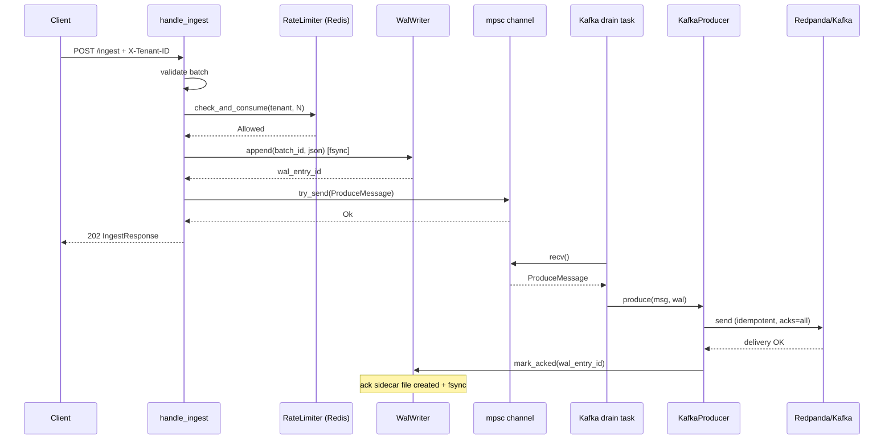
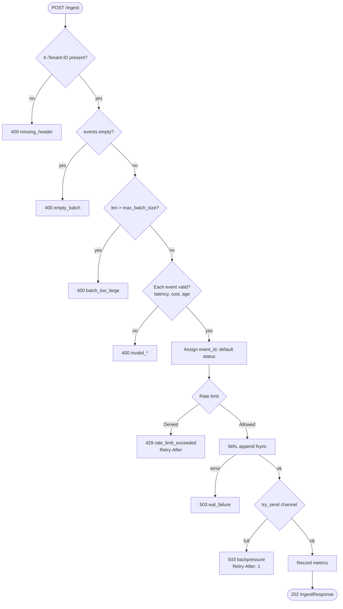
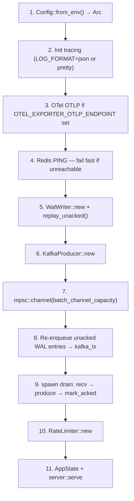
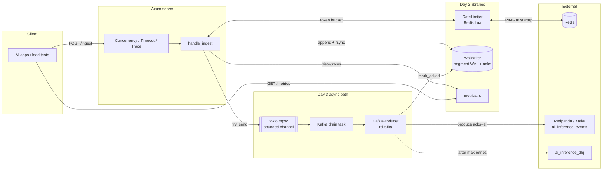

# Day 3 Learning Guide — Ingestion Engine (Part 2)

**Audience:** Engineers who completed Day 2 (`config`, `metrics`, `WAL`, rate limiter) and are wiring the **runnable** ingestion binary.

**Sources:** [7-day-plan.md](7-day-plan.md) (sessions 3A–3D), `DESIGN.md`, and the Day 2 code under `ingestion/src/`.

**Status note:** As of the repo audit in `docs/PROJECT-STATUS.md`, Day 3 modules (`kafka/producer.rs`, `handlers/ingest.rs`, `server.rs`, `main.rs`) are **specified in the plan** but may not all be committed yet. This guide teaches the **target design** you implement on Day 3.

---

## 1. Big picture — what Day 3 adds on Day 2

Day 2 gave you **configuration**, **Prometheus metrics**, a **segment WAL** with fsync and ack sidecars, and a **distributed Redis token bucket** (fail-open). None of that accepts HTTP traffic or talks to Kafka yet.

Day 3 closes the loop: an **Axum HTTP server** exposes `POST /ingest`, the **handler** validates batches and enforces rate limits, **WAL append** happens before you promise durability to the client, accepted work enters a **bounded `mpsc` channel**, and a **background drain task** drives an **idempotent rdkafka producer** that only calls `mark_acked` after Kafka confirms delivery. Failures after retries go to a **DLQ topic** while the WAL entry remains (at-least-once, replayable). After Day 3, `cargo run` in `ingestion/` should start a process you can hit with `curl`—Redpanda/Kafka and Redis must be up locally.

Architecturally, Day 3 is where DESIGN.md §2 (AP at the HTTP edge) and §4 (channel backpressure) meet code: you return **202 Accepted** when WAL + enqueue succeed, not when ClickHouse has the row.

---

## 2. Part A — Kafka producer (`ingestion/src/kafka/producer.rs`)

### Purpose

Decouple **HTTP latency** from **broker round-trips**. The handler only `try_send`s onto a channel; a dedicated task calls `KafkaProducer::produce` for each message. The producer is the only place that transitions a WAL entry from “durably on disk, not yet on the bus” to “Kafka has acknowledged this batch.”

### Durability contract with WAL

Day 2 established: **`WalWriter::append` fsyncs before returning** (`sync_all` after each line). Day 3 adds the second half of the contract:

| Stage | Who | Guarantee |
|-------|-----|-----------|
| Accepted by HTTP | Handler | WAL line written + `entry_id` returned from `append` |
| Queued for produce | Handler | `try_send` to `mpsc` succeeds (or 503 backpressure) |
| Durable on bus | `KafkaProducer::produce` | rdkafka delivery callback success → `wal.mark_acked(entry_id)` |

**`mark_acked` runs only after Kafka delivery confirmation**, not after `send()` returns. Until then, `replay_unacked()` on restart will re-offer the batch. The in-memory `WalEntry.kafka_acked` field exists for serialization; the **source of truth** for ack state is the `{wal_dir}/acks/{entry_id}.ack` sidecar file (see Day 2 `wal/writer.rs`).

If produce fails after retries, the plan sends the payload to **`kafka_dlq_topic`** and returns `Err` to the drain task. The WAL entry **stays unacked**—no silent loss; ops can replay or inspect DLQ.

### Key types and methods

**`ProduceMessage`** — one unit of work on the channel:

| Field | Role |
|-------|------|
| `batch_id` | Correlates HTTP response, WAL line, logs |
| `partition_key` | Kafka record key; plan uses **`tenant_id`** for per-tenant ordering |
| `payload` | Serialized batch JSON (`bytes::Bytes`) |
| `wal_entry_id` | Passed to `mark_acked` on success |

**`KafkaProducer`**

| Method | Behavior |
|--------|----------|
| `new(brokers, topic, dlq_topic)` | Builds `FutureProducer` with idempotence, `acks=all`, lz4, linger, retries |
| `produce(msg, wal: Arc<Mutex<WalWriter>>)` | `send` with 5s timeout; on success → `mark_acked`; on final failure → DLQ + metrics + `Err` |

**rdkafka `ClientConfig` (plan defaults):**

- `enable.idempotence = true`, `acks = all` — broker-level dedup within producer epoch; pairs with at-least-once from WAL replay
- `compression.type = lz4`, `batch.size = 1048576`, `linger.ms = 5`, `retries = 3`, `message.timeout.ms = 5000`

On DLQ path: increment `KAFKA_PRODUCE_ERRORS_TOTAL{tenant_id, "max_retries"}` (tenant from `partition_key`).

### Failure modes

| Failure | HTTP impact | WAL | Kafka / DLQ |
|---------|-------------|-----|----------------|
| Broker down / timeout after retries | None (handler already returned 202 if enqueued) | Entry remains unacked | DLQ attempt; drain logs error |
| DLQ also fails | None | Still unacked | Metric + log; manual replay from WAL |
| Process crash after WAL, before channel send | Client may retry | Unacked → replay on startup | Re-enqueued in `main` |
| Process crash after channel send, before ack | Same | Unacked | Drain retries produce |

The plan explicitly says: **do not turn produce failure into 503 on the original request**—WAL already preserved the batch.

### Sequence diagram — ingest path through WAL ack



---

## 3. Part B — Ingest handler (`ingestion/src/handlers/ingest.rs`)

### HTTP contract

| Item | Value |
|------|--------|
| Method / path | `POST /ingest` |
| Required header | `X-Tenant-ID` — must match rate-limit key and Kafka partition key |
| Body | `{ "events": [ InferenceEvent, ... ] }` |
| Success | **202 Accepted** + `IngestResponse`: `batch_id`, `event_count`, `accepted_at_unix_ms` |
| Content-Type | `application/json` |

**`InferenceEvent`** (canonical fields from plan + README schema): `event_id?`, `tenant_id`, `model_id`, `timestamp_unix_ms`, `latency_ms`, optional prefill/decode latencies, token counts, `cost_usd`, `status?`, `error_code?`, `request_id?`. Server fills missing `event_id` (UUID v4) and default `status = "success"`.

**`AppState`** (held in `Arc`, cloned per request): `config`, `kafka_tx`, `wal_writer`, `rate_limiter`.

### Validation order (strict — fail fast)

The plan mandates this **exact order** before any durable write:

1. Start latency timer (`Instant::now()`).
2. **`X-Tenant-ID`** present → else `400` `missing_header`.
3. **Batch rules:** non-empty; `len <= max_batch_size`; each event `latency_ms != 0`; `cost_usd >= 0`; `timestamp` not older than `now - max_event_age_ms`.
4. **Normalize:** assign `event_id`; default `status`.
5. **Rate limit:** `check_and_consume(tenant_id, events.len())` — see below.
6. **Serialize** events to JSON bytes.
7. **`batch_id`** = new UUID.
8. **WAL `append`** — on I/O error → `503` `wal_failure` (do not enqueue).
9. **`kafka_tx.try_send`** — on full channel → `503` `backpressure`, `Retry-After: 1`, increment `BACKPRESSURE_EVENTS_TOTAL`.
10. Record `INGESTION_LATENCY_MS` and `BATCH_SIZE_EVENTS`.
11. Return **202**.

Important ordering invariant from DESIGN.md §4: **WAL fsync completes before a successful enqueue**. If `try_send` fails, the batch is on disk but not yet on Kafka—the client should retry; duplicates are a downstream concern (`event_id`).

### Rate limit integration (Day 2)

Uses `RateLimiter::check_and_consume` from `rate_limit/token_bucket.rs`:

- **Allowed** → continue.
- **Denied** → `429`, body `rate_limit_exceeded`, header `Retry-After: (retry_after_ms / 1000) + 1`.
- **Redis down** → **fail-open** (`Allowed { remaining: 0 }`) per DESIGN.md failure table #3—ingest stays available; fairness degrades.

Cost = **number of events in the batch** (not one token per HTTP request).

### Backpressure

Bounded channel size = `config.batch_channel_capacity` (default **10_000** in current `config.rs`, aligned with DESIGN.md §4). Handler uses **`try_send`**, not blocking `send`, so Tokio worker threads do not stall behind a slow Kafka cluster.

When full: **503** + `Retry-After: 1` — honest overload signal vs. unbounded memory growth (contrast with relying only on rdkafka’s internal queue).

### Flowchart — `handle_ingest` decision tree



---

## 4. Part C — Server + main (`server.rs`, `main.rs`)

### Routes

| Method | Path | Handler |
|--------|------|---------|
| `POST` | `/ingest` | `handle_ingest` |
| `GET` | `/health` | `{"status":"ok"}` |
| `GET` | `/metrics` | Prometheus text (`gather_metrics()` from Day 2) |

### Middleware stack (outer → inner, plan order)

Applied when building the Axum `Router`:

1. **`ConcurrencyLimitLayer`** — caps in-flight requests (`max_concurrent_requests` on `Config`; add field/env when implementing 3C).
2. **`TimeoutLayer`** — 30s request budget.
3. **`TraceLayer`** — HTTP tracing (pairs with `tracing_subscriber` from `main`).

Then route handlers and `.with_state(AppState)`.

`serve` binds `0.0.0.0:{HTTP_PORT}`, logs, runs `axum::serve` with **`graceful_shutdown`** on SIGINT/SIGTERM.

### Startup sequence (numbered — match plan 3C / `main.rs`)



**Why order matters:**

- **Redis PING before listen** — catch misconfiguration early (rate limit still fail-opens at runtime, but ops get a clear startup failure).
- **WAL replay before accepting traffic** — know `unacked` count; metric `WAL_REPLAY_EVENTS_TOTAL` increments per replayed entry (Day 2 WAL).
- **Channel + drain before `serve`** — no 202 responses that cannot eventually be drained.
- **Re-enqueue (step 8)** — best-effort `send` for each `WalEntry` reconstructed into `ProduceMessage` (`partition_key` from stored JSON / tenant in payload per your reconstruction logic).

After shutdown signal, in-flight HTTP requests get graceful drain; the plan’s drain loop runs until the channel closes (production hardening may flush channel on shutdown—Day 3 baseline is the spawn loop).

---

## 5. How the parts connect



**Data plane summary:** Client → validate → rate limit → **WAL** → **channel** → **producer** → **Redpanda**; ack closes the WAL chapter. Day 4+ adds Docker Compose and a Go consumer—out of scope for Day 3, but the producer topic name is already `KAFKA_TOPIC` from `config.rs`.

---

## 6. Environment variables (Day 3 runtime)

Variables below are read by `Config::from_env()` today unless noted. Copy `deploy/.env.example` → `deploy/.env` for local Compose-aligned values.

| Variable | Default (code) | Used on Day 3 by |
|----------|----------------|------------------|
| `KAFKA_BROKERS` | `localhost:9092` | `KafkaProducer::new`, startup |
| `KAFKA_TOPIC` | `ai_inference_events` | Primary produce target |
| `KAFKA_DLQ_TOPIC` | `ai_inference_dlq` | DLQ on exhausted retries |
| `REDIS_URL` | `redis://localhost:6379` | Startup PING + `RateLimiter` |
| `HTTP_PORT` | `8080` | `server::serve` bind |
| `WAL_DIR` | `/tmp/wal` | `WalWriter::new` |
| `RATE_LIMIT_DEFAULT_RPS` | `10000` | Token bucket refill rate |
| `RATE_LIMIT_BURST_MULTIPLIER` | `2.0` | Burst capacity = `floor(rps × mult)` |
| `BATCH_CHANNEL_CAPACITY` | `10000` | `mpsc` bound (backpressure threshold) |
| `MAX_BATCH_SIZE` | `1000` | Handler validation |
| `MAX_EVENT_AGE_MS` | `3600000` (1h) | Reject stale `timestamp_unix_ms` |
| `LOG_FORMAT` | (unset → pretty) | `main`: `json` enables JSON logs |
| `RUST_LOG` / `tracing` filter | — | Via `tracing_subscriber` env filter |
| `OTEL_EXPORTER_OTLP_ENDPOINT` | (optional) | Skip OTel if unset |
| `MAX_CONCURRENT_REQUESTS` | *plan only* | `ConcurrencyLimitLayer` when you add to `Config` |

Day 3 does **not** require ClickHouse env vars for the ingestion binary; those matter from Day 4 onward.

---

## 7. Verification checklist — what “done” means

### Part A — Kafka producer

- [ ] `cargo build -p ingestion` succeeds with `kafka/producer.rs`.
- [ ] Unit/integration test or manual: produce to local Redpanda; consumer or `rpk topic consume` sees message.
- [ ] After successful delivery, `{WAL_DIR}/acks/{entry_id}.ack` exists.
- [ ] Simulated broker failure: `KAFKA_PRODUCE_ERRORS_TOTAL` increases; message lands on DLQ topic; WAL **not** acked.

### Part B — Ingest handler

- [ ] Missing `X-Tenant-ID` → 400.
- [ ] Empty batch / oversized batch / `latency_ms: 0` / negative cost / old timestamp → 400 with correct `error` field.
- [ ] Rate limit exceeded → 429 + `Retry-After`.
- [ ] WAL directory receives new `segment_*.wal` line on accepted request.
- [ ] Fill channel (tiny `BATCH_CHANNEL_CAPACITY` + slow drain) → 503 `backpressure`.

### Part C — Server + main

- [ ] `GET /health` → 200 `{"status":"ok"}`.
- [ ] `GET /metrics` → Prometheus text including `ingestion_latency_ms`, `wal_segments_pending`.
- [ ] Startup logs: Redis connected, WAL replay count, listening port.
- [ ] SIGINT stops process without panic.
- [ ] Kill process after ingest, restart: replay re-enqueues unacked batches (watch `wal_replay_events_total`).

### End-to-end (after full Day 3 + Redpanda + Redis running)

Replace `TIMESTAMP` with `date +%s000` (milliseconds) or any recent epoch ms.

**Happy path — expect 202:**

```bash
curl -sS -X POST "http://localhost:8080/ingest" \
  -H "Content-Type: application/json" \
  -H "X-Tenant-ID: demo" \
  -d '{
    "events": [{
      "tenant_id": "demo",
      "model_id": "gpt-4o",
      "timestamp_unix_ms": '"$(date +%s000)"',
      "latency_ms": 342,
      "prompt_tokens": 512,
      "completion_tokens": 128,
      "cost_usd": 0.00423,
      "status": "success"
    }]
  }'
```

**Health and metrics:**

```bash
curl -sS "http://localhost:8080/health"
curl -sS "http://localhost:8080/metrics" | head -40
```

**Missing tenant header — expect 400:**

```bash
curl -sS -o /dev/null -w "%{http_code}\n" -X POST "http://localhost:8080/ingest" \
  -H "Content-Type: application/json" \
  -d '{"events":[{"model_id":"gpt-4o","timestamp_unix_ms":'"$(date +%s000)"',"latency_ms":1,"prompt_tokens":1,"completion_tokens":1,"cost_usd":0.001}]}'
```

**Rate limit probe** (lower `RATE_LIMIT_DEFAULT_RPS` temporarily, send many events in one batch or rapid curls) — expect **429**.

Confirm Kafka path (Redpanda on `9092`):

```bash
# If rpk is available against local Redpanda
rpk topic consume ai_inference_events -n 1
```

**Definition of done (Day 3 commit message from plan):** `feat(ingestion): Kafka producer, ingest handler, server — engine runnable` — binary runs, accepts real batches, WAL + channel + producer path exercised.

---

## 8. Glossary

| Term | Meaning in this project |
|------|-------------------------|
| **WAL (write-ahead log)** | Append-only `segment_*.wal` files under `WAL_DIR`; each line is a `WalEntry` JSON; **fsync per append**. Survives process crash. Unacked entries replay to Kafka on startup. |
| **DLQ (dead-letter queue)** | Kafka topic `KAFKA_DLQ_TOPIC` (`ai_inference_dlq`). Receives batches that failed produce after rdkafka retries. WAL stays unacked so you can reconcile ops vs. data plane. |
| **Fail-open rate limit** | If Redis is unreachable or the Lua script errors, `check_and_consume` returns **Allowed** rather than blocking ingest. Protects availability; document degraded fairness (DESIGN.md §5 row 3). |
| **Backpressure** | Bounded `mpsc` between handler and drain task. When full, `try_send` fails → **503** + `Retry-After` + `backpressure_events_total`. Application-level cap before Kafka client buffers absorb unbounded memory. |
| **Idempotent producer** | rdkafka `enable.idempotence=true` with `acks=all`. Broker deduplicates retries within a producer session. Does **not** replace consumer-side dedup across WAL replays—pair with `event_id` in the warehouse later. |

---

## Quick reference — Day 2 code you call from Day 3

| Day 2 module | Day 3 usage |
|--------------|-------------|
| `config::Config` | `AppState`, channel capacity, validation limits, broker URLs |
| `metrics::*` | Handler histograms/counters; producer error counter; WAL gauges |
| `wal::WalWriter` | `append` in handler; `mark_acked` in producer; `replay_unacked` in `main` |
| `rate_limit::RateLimiter` | Before WAL in handler |

`lib.rs` today re-exports Day 2 symbols; after Day 3 you will extend it with `handlers`, `kafka`, and `server` modules and a `main` binary target in `Cargo.toml`.

---

## Further reading

- [DESIGN.md](../DESIGN.md) — AP vs CP, partition strategy (note: Day 3 plan uses **`tenant_id` only** as Kafka key; DESIGN §3 discusses `hash(tenant_id:model_id)` for hot-partition avoidance—evolve keying when you tune partitions).
- [PROJECT-STATUS.md](PROJECT-STATUS.md) — what is committed vs. planned.
- [7-day-plan.md](7-day-plan.md) — authoritative session prompts for 3A–3C.
