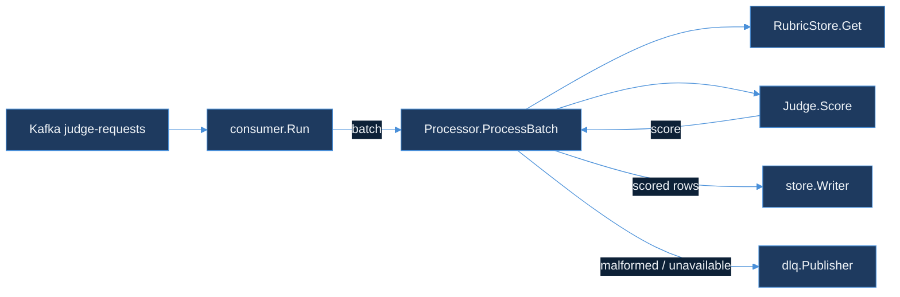

# model-quality-scorer

`model-quality-scorer` is RouteIQ's fourth module: it samples live traffic, asks a cheap judge model (Claude Haiku) to grade the response against a versioned rubric, and stores the score so a routing decision can eventually be justified by quality, not just cost and latency. Full design — the judge model choice, the `JudgeRubric` schema, the async queue topology, the 200 samples/hr/tenant throughput target, and the judge-timeout failure modes — is in [`DESIGN.md`](DESIGN.md).

**Status: Day 77 shipped the design. Day 78 implements the pipeline it committed to — `pkg/rubric`'s versioned, weighted rubric contract, `pkg/judge`'s timeout/retry/circuit-breaker judge call, `pkg/consumer`'s batched Kafka consumer, and `pkg/store`'s batched ClickHouse writer for `quality_scores`. A malformed rubric, a malformed message, and an unavailable judge all route to the DLQ with a distinct reason rather than becoming a fabricated score (DESIGN.md §5). Day 79 adds `pkg/normalize` (0-1 comparable unit alongside the raw 0-100 score) and `pkg/rollup` (query-time 1h/24h aggregation SQL plus the statistical noise floor documented in [`NOISE-FLOOR.md`](NOISE-FLOOR.md)) — see DESIGN.md §7.**

## Quickstart

```bash
go test ./...
```

Every package's tests run against in-process fakes — no live Kafka, ClickHouse, or Haiku API key required. `go run ./cmd/scorer --input samples.jsonl` runs the real batching/rubric/scoring pipeline end to end against a deterministic heuristic judge (see "Out of scope" below for what that stands in for).

```bash
cat >/tmp/samples.jsonl <<'EOF'
{"tenant_id": "acme", "task_type": "summarization", "model_id": "gpt-4o-mini", "rubric_version": 1, "prompt": "summarize this ticket", "response": "Customer reports login failures since the 2pm deploy; rollback requested."}
EOF
go run ./cmd/scorer --input /tmp/samples.jsonl
# tenant=acme task_type=summarization model=gpt-4o-mini score=... rationale="heuristic stub: ..."
```

## How the pieces fit



- **`pkg/rubric`** — the `JudgeRubric`/`Criterion` contract from DESIGN.md §2: `Load` decodes and validates a rubric template (unknown fields rejected, weights must sum to 1.0 within float tolerance), and `WeightedScore` turns a judge's per-criterion 0-10 scores into the normalized 0-100 stored score.
- **`pkg/judge`** — `HaikuJudge.Score` wraps a `Caller` (left as an interface with no production implementation wired in yet, the same deferral `cost-budget-enforcer/pkg/gateway.ModelClient` makes) with DESIGN.md §5's failure policy: a 5s timeout, one bounded retry (not a loop), and a per-`task_type` `Breaker` that opens once failures exceed 10% over a trailing 5-minute window.
- **`pkg/consumer`** — `RubricStore` resolves the shared rubric template once per batch (`FileRubricStore` reads `<task_type>.v<version>.json` templates from `rubrics/`, cached after first successful load). `Processor.ProcessBatch` runs every message in a batch through parse → rubric lookup → score, splitting the batch into rows for `store.Writer` and entries for `dlq.Publisher` — one malformed sample never blocks the rest of the batch. `Run` drains a Kafka reader, flushing on whichever comes first: `BatchSize` messages or `FlushInterval` elapsed, committing offsets only after a batch's rows and DLQ entries are both durably written.
- **`pkg/store`** — `ClickHouseWriter.WriteBatch` inserts one row per judged sample into `quality_scores` (`tenant_id`, `task_type`, `model_id`, `rubric_version`, `score`, `rationale`, `scored_at`) — see DESIGN.md §6 for why aggregation happens at query time, never at write time.
- **`pkg/dlq`** — `KafkaPublisher` writes to `judge-requests-dlq`, tagged with one of four `Reason`s (`malformed_message`, `malformed_rubric`, `judge_unavailable`, `circuit_open`) so a `judge_unavailable` sample is never silently averaged in as a passing or failing score.

## Rubric templates

`rubrics/summarization.v1.json` and `rubrics/extraction.v1.json` ship as the first two shared rubric templates — each keyed by `task_type`, not by tenant, per DESIGN.md §2. Adding a new `task_type` means adding `rubrics/<task_type>.v1.json`; bumping a rubric's criteria means shipping `.v2.json` alongside the existing `.v1.json` file, never editing `v1` in place, so a score computed under `v1` stays interpretable as `v1`'s contract.

## Out of scope

No live Haiku calls exercised in this sandbox — `judge.Caller` has no production implementation wired in yet, matching DESIGN.md's own "no live Haiku calls exercised" scope note and `cost-budget-enforcer/pkg/gateway`'s precedent for leaving a model client as an interface until a later day. `cmd/scorer`'s `heuristicJudge` is a deterministic length-ratio stand-in so the binary is runnable without an API key. No live Kafka broker or ClickHouse instance in this sandbox (no Docker daemon available) — `pkg/consumer.Run` and `pkg/store.ClickHouseWriter` are exercised against fakes/mocks in unit tests; `cmd/scorer` swaps in printing stand-ins for both. No wiring into `cost-budget-enforcer`'s gateway or `semantic-cache-engine`'s lookup path to trigger the sampling decision itself — DESIGN.md §3's "sampling decision" step (computing `sample_rate(tenant)` from trailing request volume) is a gateway-side concern deferred past this consumer-and-storage day. No 1h/24h rollup normalization — DESIGN.md's "Out of scope" note names that as a following implementation day.
