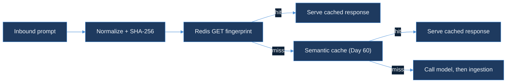

# prompt-fingerprinter — Design Document

| Field | Value |
|-------|-------|
| **Product arc** | RouteIQ (continues — opened Day 60 with `semantic-cache-engine`, `cost-budget-enforcer` joined Day 65; `prompt-fingerprinter` is the arc's third module) |
| **Status** | Design-only. No runtime code, no migrations, no new Kafka topics yet. |
| **Precedent** | Same shape as `cost-budget-enforcer`'s Day 65 DESIGN.md-first day, itself following `semantic-cache-engine`'s Day 60 precedent: the module opens with a written design before any implementation. |

**Document purpose.** `prompt-fingerprinter` catches byte-identical prompts before they ever reach `semantic-cache-engine`'s embedding-similarity lookup. Two requests can be the same request — a client retry, a scheduler replaying the same batch job, a user double-submitting a form — and a duplicate like that deserves a cache hit that costs nothing more than a Redis `GET`, not an embedding-model round trip. This document records the three design decisions needed before any code is written: how a prompt gets normalized into a canonical form, how that form becomes a fingerprint, and where the fingerprint check sits relative to the semantic cache it sits in front of.

---

## 1. Prompt normalization — canonical form before hashing

A prompt in this stack is not a bare string; it is a structured request (`{messages: [...], model, temperature, ...}`, the same shape `semantic-cache-engine`'s embedding pipeline consumes). Two requests can carry identical meaning and still arrive as different bytes: a trailing newline in one message, a client library that serializes JSON keys in a different order, incidental leading/trailing whitespace on a field. Hashing the raw request bytes would treat those as different prompts and silently miss what should have been a free hit — the fingerprint cache would still work, it would just work far less often than the traffic actually allows.

**Normalization contract**, applied identically before every fingerprint computation:

1. Trim leading/trailing whitespace on every string field (`messages[].content`, not the envelope).
2. Collapse internal runs of whitespace in each message's content to a single space — a retried request with different line-wrapping is still the same prompt.
3. Re-serialize the whole request as canonical JSON: keys sorted lexicographically, no insignificant whitespace (`json.Marshal` after decoding into a `map[string]any` with Go's default sorted-key encoding, not a hand-rolled serializer).

**One function, every call path.** `pkg/fingerprint.Normalize(req PromptRequest) []byte` is the only place this logic lives. `semantic-cache-engine`'s embedding pipeline and any future gateway path both call the same function rather than each re-implementing "trim and re-serialize" — two slightly-different normalizers would mean two prompts that should collide under one path collide under only one of them, which is a correctness bug that would be invisible until someone compared hit rates across paths.

So: normalization's whole job is making "the same prompt, different bytes" collapse to identical input before it ever reaches a hash function.

---

## 2. SHA-256 fingerprint

```
fingerprint = hex(sha256(Normalize(req)))   // 64 hex chars
key         = "fingerprint:{tenant_id}:{fingerprint}"
```

**Why SHA-256 and not a faster non-cryptographic hash** (xxhash, murmur3, fnv). The bottleneck this module is optimizing away is `semantic-cache-engine`'s embedding-model round trip (§1 of that design), not hash computation — a Redis `GET` is already O(1) and the hash itself runs in microseconds on the CPU regardless of algorithm choice at this request volume. What a faster hash would buy is negligible; what it would cost is collision resistance. A hash collision here means serving one tenant's cached response for a different prompt — in the worst case, a different tenant's content leaking across the `tenant_id` boundary the rest of this stack (`ratelimit:{tenant_id}`, `budget:{tenant_id}`, `semantic_cache_entries`'s tenant-scoped primary key) treats as inviolable. SHA-256's collision resistance is the cheap insurance against a failure mode every other shortcut in this design has to actively avoid.

**Tenant scoping mirrors the rest of the fleet.** `{tenant_id}` is part of the key, not the value, following `cost-budget-enforcer`'s `budget:{tenant_id}` and the root ingestion rate limiter's `ratelimit:{tenant_id}` — a lookup is scoped by construction, so a fingerprint collision (already vanishingly unlikely under SHA-256) would still be contained to a single tenant's keyspace rather than crossing tenants.

**This reuses a column Day 60 already reserved.** `semantic_cache_entries.prompt_hash` was documented on Day 60 as "sha256 of normalized prompt text, for exact-dup fast path" — a column semantic-cache-engine wrote to but never actually served exact-match reads against. `prompt-fingerprinter` is what turns that reserved column's purpose into a real, populated cache layer, using the identical hash definition so a fingerprint computed here matches the `prompt_hash` already sitting in a semantic cache row for the same prompt.

So: SHA-256 buys correctness (no cross-tenant collision) at a cost this module can't feel, because the actual latency budget it has to protect belongs to a different, slower operation entirely.

---

## 3. Exact-match cache — before the semantic cache, not instead of it



**Ordering is the entire design.** A Redis `GET` on a well-formed key is one round trip, sub-millisecond. `semantic-cache-engine`'s lookup needs an embedding-model call before a `pgvector` similarity search can even run — a network hop this module's check never pays. Placing the fingerprint check first means every byte-identical retry, replayed batch job, or double-submitted request gets served without the semantic path's embedding cost ever being incurred. A miss here costs one cheap Redis round trip on top of the semantic path that would have run anyway; a hit here skips that path entirely. There is no ordering that loses: checking exact-match second would mean paying the embedding call on every request just to find out, after the fact, that a free answer was sitting in Redis the whole time.

**Cache value, not a pointer into `semantic_cache_entries`.** The Redis value at `fingerprint:{tenant_id}:{fingerprint}` is the response body itself (`{response, created_at}`), not a foreign key into the `pgvector` table. A pointer would save the small duplication cost of storing the response twice, but it would also mean every fingerprint hit pays a Postgres round trip to resolve it — reintroducing exactly the latency this module exists to avoid. Storing the response inline keeps the fast path entirely inside Redis, at the cost of a response existing in two places when both an exact and a semantic hit are possible for the same prompt.

**TTL matches the semantic cache's policy, not a second decay curve.** An exact-match hit serves the same underlying response a semantic hit would; there is no reason for it to be considered fresh on a different schedule. `prompt-fingerprinter` reads the same per-tenant TTL `semantic-cache-engine`'s freshness-decay policy already configures, rather than inventing an independent expiry — one staleness policy governing both cache tiers.

So: the fingerprint cache is a cheap filter in front of an expensive one, not a competing cache with its own rules — its entire value is in how few requests need to reach the semantic path at all.

---

## 4. Sub-millisecond lookup and LensAI integration

**Target.** Redis `GET` on a warm connection, p99 under 1ms — the number in the module's brief is a latency budget, not a benchmark result. No live Redis instance is exercised in this sandbox (no Docker daemon, the same constraint Days 56, 64, and 65 all logged), so this target is a design commitment to validate once the implementation day stands up a real instance, not a measured claim.

**A new source value, distinct from the semantic cache's.** `cost-budget-enforcer/pkg/lensai` already established `gateway_cache_hit` for a semantic-cache-served request; a fingerprint hit gets its own `SourceCacheHitExact = "cache_hit_exact"` rather than reusing `cache_hit`/`gateway_cache_hit`. Collapsing the two into one value would make it impossible to answer "how much of our traffic is literal duplicates" independent of "how much is merely similar" — the first number is useful for capacity planning (retry storms, batch replay volume) regardless of whatever `similarity_threshold` the semantic cache happens to be tuned to, and folding it into the same counter would erase that signal. `cost_usd` is `0` for the same reason it is `0` on every other zero-spend path this stack already reports (`gateway_cache_hit`, `gateway_blocked`): an explicit zero, not a missing event.

So: the fingerprint hit gets its own observability identity for the same reason it gets its own cache tier — it is a materially different, materially cheaper event than a semantic hit, and collapsing the two would hide that difference from anyone reading the LensAI dashboard.

---

## Out of scope (Day 70)

No live Redis instance exercised in this sandbox (no Docker daemon — see §4). No runtime code, migrations, or Kafka topics added. No change to `semantic-cache-engine`'s schema or its `pgvector` lookup path — `prompt-fingerprinter` is strictly additive in front of it, sharing only the `prompt_hash` definition Day 60 already reserved. No gateway wiring — `cost-budget-enforcer/pkg/gateway`'s request path is where a future implementation day would insert the fingerprint check ahead of its existing cache/model routing, but that wiring is deferred past Day 70's design-only scope.
