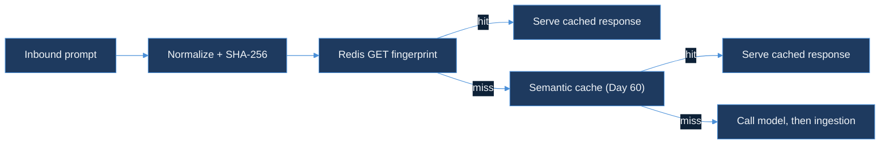

# prompt-fingerprinter — Design Document

| Field | Value |
|-------|-------|
| **Product arc** | RouteIQ (continues — opened Day 60 with `semantic-cache-engine`, `cost-budget-enforcer` joined Day 65; `prompt-fingerprinter` is the arc's third module) |
| **Status** | Design-only. No runtime code, no migrations, no new Kafka topics yet. |
| **Precedent** | Same shape as `cost-budget-enforcer`'s Day 65 DESIGN.md-first day, itself following `semantic-cache-engine`'s Day 60 precedent: the module opens with a written design before any implementation. |

**Document purpose.** `prompt-fingerprinter` catches byte-identical prompts before they ever reach `semantic-cache-engine`'s embedding-similarity lookup. Two requests can be the same request — a client retry, a scheduler replaying the same batch job, a user double-submitting a form — and a duplicate like that deserves a cache hit that costs nothing more than a Redis `GET`, not an embedding-model round trip. This document records the three design decisions needed before any code is written: how a prompt gets normalized into a canonical form, how that form becomes a fingerprint, and where the fingerprint check sits relative to the semantic cache it sits in front of.

---

## 1. Prompt normalization — canonical form before hashing

A prompt in this stack is not a bare string; it is a structured request (`{messages: [...], model, temperature, ...}`, the same shape `semantic-cache-engine`'s embedding pipeline consumes). Two requests can carry identical meaning and still arrive as different bytes: a trailing newline in one message, a client library that serializes JSON keys in a different order, incidental leading/trailing whitespace on a field. Hashing the raw request bytes would treat those as different prompts and silently miss what should have been a free hit — the fingerprint cache would still work, it would just work far less often than the traffic actually allows.

**Normalization contract**, applied identically before every fingerprint computation:

1. Trim leading/trailing whitespace on every string field (`messages[].content`, not the envelope).
2. Collapse internal runs of whitespace in each message's content to a single space — a retried request with different line-wrapping is still the same prompt.
3. Re-serialize the whole request as canonical JSON: keys sorted lexicographically, no insignificant whitespace (`json.Marshal` after decoding into a `map[string]any` with Go's default sorted-key encoding, not a hand-rolled serializer).

**One function, every call path.** `pkg/fingerprint.Normalize(req PromptRequest) []byte` is the only place this logic lives. `semantic-cache-engine`'s embedding pipeline and any future gateway path both call the same function rather than each re-implementing "trim and re-serialize" — two slightly-different normalizers would mean two prompts that should collide under one path collide under only one of them, which is a correctness bug that would be invisible until someone compared hit rates across paths.

So: normalization's whole job is making "the same prompt, different bytes" collapse to identical input before it ever reaches a hash function.

---

## 2. SHA-256 fingerprint

```
fingerprint = hex(sha256(Normalize(req)))   // 64 hex chars
key         = "fingerprint:{tenant_id}:{fingerprint}"
```

**Why SHA-256 and not a faster non-cryptographic hash** (xxhash, murmur3, fnv). The bottleneck this module is optimizing away is `semantic-cache-engine`'s embedding-model round trip (§1 of that design), not hash computation — a Redis `GET` is already O(1) and the hash itself runs in microseconds on the CPU regardless of algorithm choice at this request volume. What a faster hash would buy is negligible; what it would cost is collision resistance. A hash collision here means serving one tenant's cached response for a different prompt — in the worst case, a different tenant's content leaking across the `tenant_id` boundary the rest of this stack (`ratelimit:{tenant_id}`, `budget:{tenant_id}`, `semantic_cache_entries`'s tenant-scoped primary key) treats as inviolable. SHA-256's collision resistance is the cheap insurance against a failure mode every other shortcut in this design has to actively avoid.

**Tenant scoping mirrors the rest of the fleet.** `{tenant_id}` is part of the key, not the value, following `cost-budget-enforcer`'s `budget:{tenant_id}` and the root ingestion rate limiter's `ratelimit:{tenant_id}` — a lookup is scoped by construction, so a fingerprint collision (already vanishingly unlikely under SHA-256) would still be contained to a single tenant's keyspace rather than crossing tenants.

**This reuses a column Day 60 already reserved.** `semantic_cache_entries.prompt_hash` was documented on Day 60 as "sha256 of normalized prompt text, for exact-dup fast path" — a column semantic-cache-engine wrote to but never actually served exact-match reads against. `prompt-fingerprinter` is what turns that reserved column's purpose into a real, populated cache layer, using the identical hash definition so a fingerprint computed here matches the `prompt_hash` already sitting in a semantic cache row for the same prompt.

So: SHA-256 buys correctness (no cross-tenant collision) at a cost this module can't feel, because the actual latency budget it has to protect belongs to a different, slower operation entirely.

---

## 3. Exact-match cache — before the semantic cache, not instead of it



**Ordering is the entire design.** A Redis `GET` on a well-formed key is one round trip, sub-millisecond. `semantic-cache-engine`'s lookup needs an embedding-model call before a `pgvector` similarity search can even run — a network hop this module's check never pays. Placing the fingerprint check first means every byte-identical retry, replayed batch job, or double-submitted request gets served without the semantic path's embedding cost ever being incurred. A miss here costs one cheap Redis round trip on top of the semantic path that would have run anyway; a hit here skips that path entirely. There is no ordering that loses: checking exact-match second would mean paying the embedding call on every request just to find out, after the fact, that a free answer was sitting in Redis the whole time.

**Cache value, not a pointer into `semantic_cache_entries`.** The Redis value at `fingerprint:{tenant_id}:{fingerprint}` is the response body itself (`{response, created_at}`), not a foreign key into the `pgvector` table. A pointer would save the small duplication cost of storing the response twice, but it would also mean every fingerprint hit pays a Postgres round trip to resolve it — reintroducing exactly the latency this module exists to avoid. Storing the response inline keeps the fast path entirely inside Redis, at the cost of a response existing in two places when both an exact and a semantic hit are possible for the same prompt.

**TTL matches the semantic cache's policy, not a second decay curve.** An exact-match hit serves the same underlying response a semantic hit would; there is no reason for it to be considered fresh on a different schedule. `prompt-fingerprinter` reads the same per-tenant TTL `semantic-cache-engine`'s freshness-decay policy already configures, rather than inventing an independent expiry — one staleness policy governing both cache tiers.

So: the fingerprint cache is a cheap filter in front of an expensive one, not a competing cache with its own rules — its entire value is in how few requests need to reach the semantic path at all.

---

## 4. Sub-millisecond lookup and LensAI integration

**Target.** Redis `GET` on a warm connection, p99 under 1ms — the number in the module's brief is a latency budget, not a benchmark result. No live Redis instance is exercised in this sandbox (no Docker daemon, the same constraint Days 56, 64, and 65 all logged), so this target is a design commitment to validate once the implementation day stands up a real instance, not a measured claim.

**A new source value, distinct from the semantic cache's.** `cost-budget-enforcer/pkg/lensai` already established `gateway_cache_hit` for a semantic-cache-served request; a fingerprint hit gets its own `SourceCacheHitExact = "cache_hit_exact"` rather than reusing `cache_hit`/`gateway_cache_hit`. Collapsing the two into one value would make it impossible to answer "how much of our traffic is literal duplicates" independent of "how much is merely similar" — the first number is useful for capacity planning (retry storms, batch replay volume) regardless of whatever `similarity_threshold` the semantic cache happens to be tuned to, and folding it into the same counter would erase that signal. `cost_usd` is `0` for the same reason it is `0` on every other zero-spend path this stack already reports (`gateway_cache_hit`, `gateway_blocked`): an explicit zero, not a missing event.

So: the fingerprint hit gets its own observability identity for the same reason it gets its own cache tier — it is a materially different, materially cheaper event than a semantic hit, and collapsing the two would hide that difference from anyone reading the LensAI dashboard.

---

## Out of scope (Day 70)

No live Redis instance exercised in this sandbox (no Docker daemon — see §4). No runtime code, migrations, or Kafka topics added. No change to `semantic-cache-engine`'s schema or its `pgvector` lookup path — `prompt-fingerprinter` is strictly additive in front of it, sharing only the `prompt_hash` definition Day 60 already reserved. No gateway wiring — `cost-budget-enforcer/pkg/gateway`'s request path is where a future implementation day would insert the fingerprint check ahead of its existing cache/model routing, but that wiring is deferred past Day 70's design-only scope.

---

## 5. OpenTelemetry spans for cache tier decisions (Day 74)

`pkg/stack.Stack.Get` now wraps its whole tier-resolution flow in a single `prompt_fingerprinter.stack.get` span, closing the gap between what `Metrics` already counts (§4's `IncL1Hit`/`IncL2Hit`/`IncMiss`) and what a trace viewer can see per request. The span carries a `cache.tier` attribute set to `l1`, `l2`, or `miss` — the same three-way distinction §4 argues for, now visible next to whatever spans a future gateway integration produces around this call, not just in an aggregate counter.

**No SDK wiring required to stay correct.** `pkg/stack` calls `otel.Tracer(...)` at the package level and starts a span on every `Get`, but never configures a `TracerProvider` itself. `go.opentelemetry.io/otel`'s global default is a no-op provider until something — a `cmd/` binary, a test — installs a real one, so `Get`'s behavior and return values are unchanged whether or not tracing is active. This mirrors the `Metrics` interface's existing "nil is valid" contract (§goal of DESIGN.md's Redis-optionality throughout): observability is additive, never load-bearing for correctness.

**Deferred to gateway wiring.** No `TracerProvider` is constructed or exported anywhere in this module — that belongs to whichever binary eventually wires `Stack` into a live request path (§ "No gateway wiring" above), the same day that would also stand up a real `RedisClient` and `L2Store` against live infra.

---

## 6. Week 3 preview — `model-quality-scorer` scope (Day 75+)

RouteIQ's fourth module starts once `prompt-fingerprinter`'s remaining Week 2 days close it out (Day 75 ships the exact-match cache with a real hit-rate benchmark and `BENCHMARKS.md`; Day 76 adds the admin `PUT /tenants/{id}/fingerprint-rules` endpoint and emits `cache_hit_type=exact` to the LensAI Kafka topic). `model-quality-scorer` is the piece that turns RouteIQ's routing decision from cost-and-latency-only into cost-latency-*and*-quality:

- **Day 77 — design.** Judge model (Haiku) scoring a rubric defined per `task_type` as a JSON schema, an async queue topology decoupling judging from the request path, a target of 200 samples/hour/tenant, and documented failure modes for a judge call that times out.
- **Day 78 — ingestion.** A Kafka consumer on `judge-requests` batches calls to the judge model against the shared rubric template and persists raw scores plus rationale to a ClickHouse `quality_scores` table, with a DLQ for a malformed rubric.
- **Day 79 — rollups.** Judge outputs normalize to a 0–1 scale, rolled up into 1h/24h aggregates keyed by `model_id × task_type`, wired into a Grafana panel on the LensAI dashboard, with a documented statistical noise floor so a rollup built on too few samples isn't read as a confident signal.
- **Day 80 — RouteIQ v1.** The decision engine this whole arc has been building toward: a weighted utility `U = w_q·quality − w_c·cost − w_l·latency` with tenant-overridable weights, tie-breaking toward the cheaper model when two candidates' `U` falls within an epsilon of each other.

`prompt-fingerprinter` and `model-quality-scorer` don't share code — the fingerprint cache's job ends at "was this exact prompt already answered," which has nothing to do with scoring a *novel* response's quality. What they share is the Kafka-topic-to-ClickHouse-to-LensAI-dashboard shape every RouteIQ module since Day 60 has used, and the same tenant-scoped keying discipline §2 argues for here.

---

## 7. Cross-links — RouteIQ arc and LensAI

- [`semantic-cache-engine/DESIGN.md`](../semantic-cache-engine/DESIGN.md) — Day 60, the arc's first module and the source of the `prompt_hash` column definition this module reuses (§2).
- [`cost-budget-enforcer/DESIGN.md`](../cost-budget-enforcer/DESIGN.md) — Day 65, the arc's second module; `pkg/lensai`'s `SourceGatewayCacheHit` is the precedent §4 follows for giving an exact-match hit its own source value rather than collapsing it into a semantic-cache hit.
- [`../OBSERVABILITY.md`](../OBSERVABILITY.md) — root LensAI dashboard/runbook index. `prompt-fingerprinter` has no dashboard entry yet (§5's spans have no exporter wired up, and §4's `cache_hit_exact` source value is still gateway-wiring-deferred, per "Out of scope" above) — this link exists so a future day adding one starts from the existing dashboard conventions instead of inventing new ones.

---

## 8. Admin API, tenant-configurable rules, and LensAI wiring (Day 76)

Three gaps §6 committed to for Day 76, all closed today.

**`PUT /tenants/{id}/fingerprint-rules` (`pkg/admin`).** A tenant can now configure
`strip_punctuation`, `lowercase`, and `max_prompt_bytes` — normalization overrides layered on top
of §1's fixed contract, not a replacement for it. `pkg/fingerprint.Rules` is the type; its zero
value is a documented no-op (`Rules{}.Apply(req) == req`), so a tenant that has never called this
endpoint fingerprints exactly as every tenant did on Day 70. `pkg/rules.Store` holds the
configured value per tenant behind a `PUT`, not `cost-budget-enforcer/pkg/admin`'s `PATCH`: three
small boolean/int fields is a resource small enough that "send the whole thing" is the simpler
contract, and doesn't need a second pointer-field patch type only for this endpoint.

**Why layering, not replacing, matters.** §1 committed to `Normalize` being "the only place this
logic lives... two slightly-different normalizers would mean two prompts that should collide under
one path collide under only one of them." `Rules` doesn't relax that: the base contract
(trim, collapse, canonical JSON) still runs identically on every request from every tenant. What
`Rules` changes is what bytes reach that contract, and it does so the same way for a given
tenant's own requests every time — the collision guarantee still holds *within* a tenant's
keyspace, which is the only scope it was ever a guarantee for (§2's tenant-scoped key already
means two tenants' fingerprints were never comparable to begin with).

**`Stack.Rules` and `Stack.Emitter` (`pkg/stack`).** Both new fields on `Stack`, both optional —
nil behaves exactly as every pre-Day-76 `Stack` did, the same "additive, not load-bearing"
contract `Metrics` already established. When `Rules` is set, `Get` applies the tenant's rules
before fingerprinting; when `Emitter` is set, an L1 hit posts a `cache_hit_exact` event
best-effort, mirroring the L2-hit Redis backfill's own "already durably recorded via `Metrics`,
so a failed side-effect costs only this one signal, not correctness" reasoning.

**`cache_hit_type=exact` reaches LensAI (`pkg/lensai`).** `SourceCacheHitExact = "cache_hit_exact"`
was reserved in §4 on Day 70 and never had a writer until today. `pkg/lensai.Writer` mirrors
`cost-budget-enforcer/pkg/lensai`'s `Writer`/`Event` shape exactly — the same `/ingest` HTTP
envelope every Go producer in this repo posts through, which is what actually reaches LensAI's
Kafka topic on the Rust ingestion side. No direct Kafka client in this module, same as every
sibling `pkg/lensai`.

**Integration test.** `pkg/stack/integration_test.go`'s
`TestIntegration_DuplicatePromptSkipsEmbeddingAPI` sends an identical prompt twice through `Stack`
with a call-counting `L2Store` fake standing in for the embedding API, and asserts exactly one
call — the concrete proof of this module's entire reason to exist. A second test,
`TestIntegration_AdminRulesExpandDuplicateDetection`, wires `pkg/admin.Handler` behind an
`httptest.Server`, `PUT`s rules for a tenant, and shows two prompts differing only in case and
punctuation — which would split across a miss-then-hit under the Day 70 default — now both
resolve at L1 once the tenant opts in.

**Out of scope.** No audit trail for a `Rules` change — `cost-budget-enforcer/pkg/audit`'s
publish-or-rollback contract is specific to budget changes with real financial consequences; a
normalization-rule change has no equivalent "roll back the money" case, and if one is needed
later it should reuse that package rather than fork a second one. No live Redis, Postgres, or
Kafka broker exercised (no Docker daemon, the same constraint every prior day here has logged) —
`pkg/admin` and `pkg/lensai` are both tested against `httptest.Server` fakes. No gateway wiring,
same note §3 has carried since Day 70.

