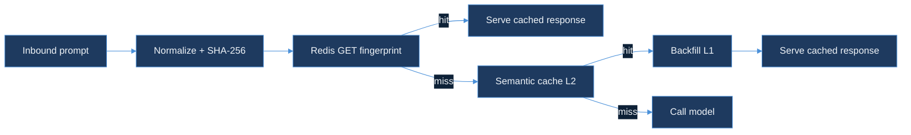

# prompt-fingerprinter

`prompt-fingerprinter` is RouteIQ's third module (after `semantic-cache-engine` and `cost-budget-enforcer`): an exact-match SHA-256 cache that sits in front of `semantic-cache-engine`'s embedding-similarity lookup and catches byte-identical prompts — client retries, replayed batch jobs, double-submitted forms — before they pay for an embedding-model round trip. Full design — the normalization contract, why SHA-256 over a faster hash, and why the exact-match check runs before the semantic one rather than instead of it — is in [`DESIGN.md`](DESIGN.md).

**Status: Day 70 shipped the design. Day 73 added the L1/L2 stack's collision drill and per-tenant TTL isolation (`pkg/stack/collision_test.go`). Day 74 wrapped `Stack.Get` in an OpenTelemetry span carrying a `cache.tier` attribute, additive and safe with no `TracerProvider` configured. Day 75 ships the real hit-rate and latency benchmark `DESIGN.md` §6 committed to — see [`BENCHMARKS.md`](BENCHMARKS.md).**

## Quickstart

```bash
go test ./...
```

Tests run against `pkg/stack`'s `MemRedis` — an in-process `map[string]memEntry` under a mutex (`pkg/stack/memstore.go`) — so `Stack.Get`'s L1/L2 composition is exercised without a live Redis instance (no Docker daemon in this build environment, the same constraint every other module in this repo has logged).

## How the pieces fit



- **`pkg/fingerprint`** — `Normalize` collapses a `PromptRequest` to canonical form (trim, collapse internal whitespace, re-serialize as sorted-key JSON), `Fingerprint` hexes its SHA-256, and `RedisKey` scopes the lookup key by `tenant_id` — the same tenant-boundary discipline `cost-budget-enforcer/pkg/store`'s `budget:{tenant_id}` keys use.
- **`pkg/stack`** — `Stack.Get` runs DESIGN.md §3's lookup order: fingerprint the request, check Redis (L1) first, fail open to L2 on either a miss or a Redis error, and backfill an L2 hit into Redis (`HardTTL` = 30 days, matching `semantic-cache-engine`'s freshness-decay hard ceiling) so the next identical prompt resolves at L1. Every call emits a `prompt_fingerprinter.stack.get` span tagged `cache.tier` (`l1`/`l2`/`miss`) alongside the existing `Metrics` counters — both optional, neither load-bearing for correctness.

## Wiring it up

```go
stack := &stack.Stack{
    Redis:   myRedisClient,   // implements stack.RedisClient
    L2:      semanticCache,   // implements stack.L2Store, e.g. an adapter over semantic-cache-engine/pkg/lookup.Lookup
    Metrics: myMetrics,       // implements stack.Metrics, or nil to skip counting
}

result, err := stack.Get(ctx, tenantID, fingerprint.PromptRequest{
    Messages: []fingerprint.Message{{Role: "user", Content: prompt}},
    Model:    "gpt-4o",
})
if result.Hit {
    // result.Tier is stack.TierL1 or stack.TierL2 — serve result.Response
}
```

`L2Store` is an interface, not a direct import of `semantic-cache-engine` — the two remain separate Go modules in this repo with no shared `go.work`. A concrete adapter implementing `L2Store` against `semantic-cache-engine/pkg/lookup.Lookup` is gateway-wiring work, deferred past this module's current scope (see `DESIGN.md`'s "Out of scope").

## Benchmarks (Day 75)

`pkg/stack/bench_test.go` measures the L1 path against `MemRedis` (a lower bound — it excludes the Redis network round trip a live instance would pay) and a `slowL2` 15ms stand-in for the semantic path:

| Metric | Result |
|---|---|
| L1 hit latency, p50 | 7.47µs |
| L1 hit latency, p99 | 52.31µs |
| Hit rate, 4,000-request / 35%-dup-rate workload | 32.6% (1,306 of 4,000 L2 calls avoided) |

See [`BENCHMARKS.md`](BENCHMARKS.md) for the full methodology, reproduction commands, and the honest gap (no live Redis exercised in this sandbox).

## Out of scope

No live Redis instance exercised anywhere in this module (no Docker daemon in this build environment — every benchmark and test runs against `MemRedis`). No gateway wiring — nothing in this repo yet calls `Stack.Get` from a real request path; that lands when a future day wires `cost-budget-enforcer/pkg/gateway` (or a successor) to check the fingerprint cache ahead of its existing cache/model routing. No `TracerProvider` construction or export — `pkg/stack`'s spans are emitted against the OpenTelemetry global no-op provider until a binary wiring this module in configures a real one. See [`DESIGN.md`](DESIGN.md) for the full per-day scope notes.
