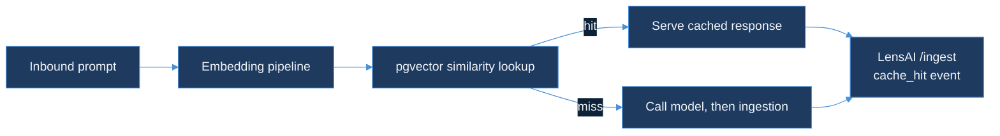

# semantic-cache-engine — Design Document

| Field | Value |
|-------|-------|
| **Product arc** | RouteIQ (opened Day 60 — the routing/caching layer named in Day 58's synthesis post as "what consumes what TraceForge observes") |
| **Status** | Design-only. No runtime code, no migrations, no new Kafka topics yet. |
| **Precedent** | Same shape as `ebpf-llm-tracer`'s Day 14 DESIGN.md-first day: the arc opens with a written design before any implementation. |

**Document purpose.** `semantic-cache-engine` caches LLM responses keyed by **embedding similarity** rather than exact prompt match, so two prompts with the same intent but different wording ("summarize this doc" vs. "give me a summary of this document") can still hit cache. This document records the six design decisions needed before any code is written: the embedding pipeline, the pgvector schema, the per-tenant similarity threshold, the false-positive budget, how cache hits land in LensAI's existing event pipeline, and the TTL/freshness decay policy.

---

## 1. Embedding pipeline

The embedding call sits **between the existing ingestion boundary and the cache lookup**, as an additional step ahead of the current `ingestion` → Kafka → `consumer` path — not inside it:



**Pluggable interface, not a hard dependency.** No live embedding model is available in this build's sandbox, so the pipeline is specified as a trait/interface boundary (`Embedder::embed(text: &str) -> Vec<f32>`) rather than a call to a named model. This keeps the design implementable against a local model (e.g. a small sentence-transformer) or a hosted API without committing to one on Day 60.

**Assumed dimension.** `N = 1536`, matching common hosted embedding output sizes (e.g. OpenAI `text-embedding-3-small`) — chosen because it is a widely-supported default for pgvector's `ivfflat` index, not because a specific provider is locked in. The schema in §2 stores `N` as a build-time constant so a future implementation can change it without a data-model rewrite (only a re-embed + reindex).

**Where it does not sit.** The embedding call is **not** inserted into `ingestion`'s WAL → Kafka → produce hot path (see root `DESIGN.md` §2 and §4). Embedding is a pre-inference lookup, ahead of the point where an inference actually happens; it must not add latency to the accepted-event durability boundary that `ingestion` already guarantees.

So: the embedding pipeline is a new entry point in front of inference, not a modification to the existing durability-critical ingest path.

---

## 2. pgvector schema

```sql
CREATE TABLE semantic_cache_entries (
    tenant_id      TEXT        NOT NULL,
    prompt_hash    TEXT        NOT NULL,   -- sha256 of normalized prompt text, for exact-dup fast path
    embedding      vector(1536) NOT NULL,
    response       TEXT        NOT NULL,
    created_at     TIMESTAMPTZ NOT NULL DEFAULT now(),
    last_hit_at    TIMESTAMPTZ NOT NULL DEFAULT now(),
    PRIMARY KEY (tenant_id, prompt_hash)
);

CREATE INDEX semantic_cache_embedding_idx
    ON semantic_cache_entries
    USING hnsw (embedding vector_cosine_ops)
    WITH (m = 16, ef_construction = 64);
```

**hnsw over ivfflat.** `ivfflat` requires a representative sample at index build time and its recall degrades until the table has enough rows to satisfy the configured `lists` parameter — a poor fit for a cache table that starts empty and grows continuously per tenant. `hnsw` builds incrementally with no training step and gives better recall at the same latency for the write-heavy, always-growing access pattern a cache has. The cost is higher build-time memory per index, judged acceptable because cache tables are pruned by the TTL policy in §6 and stay bounded per tenant.

**Multi-tenant composition.** `tenant_id` is the leading column of the primary key and every lookup is scoped `WHERE tenant_id = $1`, mirroring the tenant-scoping already used in `ingestion` (per-tenant rate limits) and `consumer` (per-tenant Redis overflow keys, per `tenant_id:model_id` anomaly detection). No cross-tenant lookups are possible by construction — a tenant can only ever get a cache hit against its own prior prompts, which also keeps the false-positive blast radius (§4) tenant-scoped.

**Why not a single global index.** A single `hnsw` index over all tenants would let a large tenant's density dominate approximate-nearest-neighbor recall for a small tenant sharing the same index. Partitioning the table by `tenant_id` (Postgres native partitioning) is the intended production shape; Day 60 documents the logical schema above and defers the partition DDL to the implementation day.

So: the schema borrows the same tenant-scoping discipline the rest of the stack already uses, rather than inventing a new isolation model for the cache.

---

## 3. Similarity threshold per tenant

The similarity threshold is a **per-tenant config value**, not a global constant — same shape as the existing `TENANT_LIMITS_PATH` per-tenant rate-limit config in `ingestion` (documented in `OBSERVABILITY.md`'s rate-limiting section).

```json
{
  "default": { "similarity_threshold": 0.94 },
  "tenant-a": { "similarity_threshold": 0.97 }
}
```

**Default: `0.94` cosine similarity.** This is deliberately conservative (closer to exact-match than to loose semantic matching).

**The tradeoff.** Set the threshold too low and prompts that are topically similar but intent-different ("delete my account" vs. "how do I delete my account") can collide, serving a **wrong cached answer** — a correctness failure, not just a stale one. Set it too high and the cache rarely fires, which only costs money (a cache miss just falls through to a real inference call, per §1) rather than correctness. Given that asymmetry — false hits are a correctness bug, false misses are a cost inefficiency — the default is tuned toward the safe side, and tenants that have validated their own prompt distribution can lower it via the per-tenant config.

So: the threshold is a per-tenant dial specifically because "safe default" and "aggressive tenant that has measured its own false-positive rate" are different customers, and one global number cannot serve both.

---

## 4. False-positive budget

**What a false positive costs.** A false positive here means the cache served a response to a semantically-different prompt than the one that produced it — the user gets a wrong answer with no signal that it came from a shortcut. This is worse than a slow response or an error, because it is silently wrong.

**Target upper bound.** False-positive rate ≤ **0.1%** of cache hits, tenant-scoped (not global — a single noisy tenant should not obscure a healthy one). This mirrors the day's AI Learning post's "dollars-not-vibes" framing for making an internal quality claim testable: a threshold is not "safe" until it has a number and a measurement plan attached to it.

**How the design would measure it.** Every cache hit already emits a `cache_hit` event (§5) carrying `tenant_id`, `prompt_hash`, and the matched entry's `prompt_hash`. A sampled human/LLM-judge review pass — out of scope for Day 60's runtime, but represented as a required consumer of the `cache_hit` event stream — labels a rolling sample of hits as correct/incorrect. The false-positive rate is `incorrect / sampled`, computed per tenant per rolling window, and is what the per-tenant `similarity_threshold` (§3) gets tuned against once real traffic exists.

**Where the budget breaks.** If a tenant's measured false-positive rate exceeds the 0.1% bound, the corrective action is raising that tenant's `similarity_threshold`, not a global change — consistent with §3's per-tenant scoping.

So: the false-positive budget turns "the cache feels accurate" into a number with a measurement path, using the same event stream the cache already needs for the integration in §5.

---

## 5. Integration with LensAI `cache_hit` events

Cache hits reuse the existing `InferenceEvent.source` discriminator field (`ingestion/src/handlers/event.rs::InferenceEvent`, documented in `OBSERVABILITY.md`) instead of introducing a parallel event type or a second table.

**Existing values.** Two values are already live in the ClickHouse `infra_ai.inference_events` table: `source='inference'` (native LensAI events, the default set by `ingestion/src/handlers/validate.rs::normalize_events` when the field is absent) and `source='benchmark_run'` (set by `agent-benchmark-runner`'s dual-write, per `OBSERVABILITY.md`'s `source` / `trace_id` section). `tool-call-analyzer` additionally sets `source='tool_call'` on its own dual-write path (`tool-call-analyzer/pkg/lensai/writer.go::SourceToolCall`) — so this table already carries more than one non-native producer before Day 60.

**New value.** `semantic-cache-engine` adds `source='cache_hit'` as a further documented value on the same field. When a lookup in §2's table hits, the cache layer posts an `InferenceEvent` to LensAI's existing `/ingest` endpoint with `source='cache_hit'`, `trace_id` set to the matched entry's `prompt_hash` (so a hit can be traced back to the request that originally populated the cache), `latency_ms` set to the cache lookup latency (not the original inference's latency), and `cost_usd` set to `0` (a cache hit performs no model call). This keeps one clearinghouse ledger — the same design principle Day 59 established for `benchmark_run` — instead of a parallel cache-metrics table that would need its own dashboard and its own join back to `tenant_id`/`model_id` cost data.

**Why this matters for §3 and §4.** Because hits land in the same table as real inferences, a Grafana panel can compute "cache hit rate" and "dollars saved by cache" (`cost_usd` the *equivalent* inference would have cost, carried as a separate field, minus the `0` actually spent) without a cross-service join — the same benefit `OBSERVABILITY.md` already documents for the `benchmark_run` discriminator.

So: `cache_hit` is additive to a pattern that already has two producers, not a new integration surface.

---

## 6. TTL and freshness decay policy

Cached entries lose relevance over time even if never evicted for size, because the underlying model or the world the prompt refers to can change.

**Decay function.** Each entry's effective similarity threshold tightens with age: `effective_threshold = base_threshold + min(decay_ceiling, age_days * decay_rate)`, with `decay_rate = 0.002/day` and `decay_ceiling = 0.03`. A fresh entry uses the tenant's configured threshold from §3 unchanged; a 15-day-old entry needs a closer match to still qualify as a hit. This makes old entries progressively harder to match rather than categorically stale, so a genuinely still-relevant old prompt can still hit if the new prompt is close enough.

**Hard TTL ceiling.** Regardless of decay, an entry is deleted after **30 days** (`created_at`), matching this repo's existing retention posture (`docs/DATA-RETENTION.md`) rather than inventing a separate policy. `last_hit_at` does not extend the hard ceiling — a frequently-hit entry still expires at 30 days and must be repopulated by a fresh inference, which bounds staleness independent of traffic volume.

**Why decay and a hard ceiling, not just one.** A hard ceiling alone would let an entry serve stale answers right up to the 30-day cliff at full threshold looseness. Decay alone would let a popular, cheap-to-keep entry live forever. Combining them means popular entries still get progressively harder to match as they age, while unpopular ones are bounded by the same ceiling as popular ones.

So: freshness is enforced by two independent mechanisms — a monotonic tightening of match difficulty, and an unconditional expiry — so neither a busy cache nor a quiet one can drift arbitrarily stale.

---

## 7. Implementation notes (Day 61 — embedding worker)

Day 60 left this document design-only; Day 61 implements the embedding pipeline half of §1 (`pkg/embedder`, `pkg/prompthash`, `pkg/cachestore`, `pkg/worker`, `cmd/embedworker`). The similarity lookup, LensAI dual-write (§5), and TTL decay (§6) are still design-only — they read from the cache this worker populates, and are natural follow-on days.

**`Embedder::embed` became a concrete `OpenAIEmbedder`.** §1 specified the interface without committing to a provider "since no live embedding model is available in this build's sandbox." That constraint no longer holds — this build's environment carries a real `OPENAI_API_KEY` — so `pkg/embedder.OpenAIEmbedder` calls `text-embedding-3-small` for real, confirming the §1 assumed `N=1536` dimension is exactly what the API returns. The `Embedder` interface stays (`pkg/worker`'s tests use a fake, never a real API key), so a future day can add a local sentence-transformer implementation without touching the worker.

**pgvector via `pgx/v5`, not a pgvector-specific driver extension.** `pkg/cachestore.PostgresWriter` renders each embedding as pgvector's text literal (`vectorLiteral`, e.g. `[0.1,0.2,...]`) and passes it as a plain string parameter, rather than depending on `pgvector-go`'s typed wrapper. This keeps the module's only third-party dependency `github.com/jackc/pgx/v5`, consistent with the rest of this repo's plain-driver preference (`ClickHouseWriter`, `ingestion`'s Redis client) over ORM-style wrappers, at the cost of no compile-time dimension check on the Go side — enforced instead at `WriteEntries` by comparing `len(e.Embedding)` against `embedder.Dimension`.

**Idempotency has two layers, matching the Day 61 plan item's "idempotent on prompt_hash" literally.** `pkg/worker.Run` dedups by `(tenant_id, prompt_hash)` within a single input batch before spending an embedding API call, and `pkg/cachestore`'s `INSERT ... ON CONFLICT (tenant_id, prompt_hash) DO NOTHING` makes a duplicate *across* separate worker runs a no-op at the database — re-running the same JSONL input twice (a crash-and-retry, a re-queued job) never double-embeds or double-charges the OpenAI bill for prompts already cached.

**No pgvector service in this repo's CI yet.** `pkg/cachestore/integration_test.go` is gated behind `//go:build integration` and skips unless `PGVECTOR_DSN` is set (same shape as `agent-benchmark-runner/pkg/store`'s `CLICKHOUSE_DSN` gate) — this repo's `integration.yml` workflow does not currently run a Postgres+pgvector service container, so these tests exercise real upsert/idempotency behavior locally but not yet in CI. Adding that service container is scoped to whichever future day wires up the similarity lookup path (§1), since that is the point at which pgvector's `hnsw` query behavior — not just insert idempotency — needs CI coverage.

---

## 8. Implementation notes (Day 62 — cache lookup path)

Day 61 left the similarity lookup, LensAI dual-write, and TTL decay design-only. Day 62 implements the lookup half of §1 and all of §5 (`pkg/config`, `pkg/lensai`, `pkg/lookup`, `cmd/cachelookup`); §6's TTL decay is still design-only and remains a natural follow-on day.

**Shipped default threshold is `0.92`, not §3's `0.94`.** §3 fixed `0.94` as a conservative design-time estimate, chosen before any hit was traceable back to the request that populated the entry it matched. Now that every hit carries `trace_id=<matched prompt_hash>` in its `cache_hit` event (§5, below), a wrong hit is diagnosable after the fact rather than silent, so the shipped default (`pkg/config.DefaultThreshold`) is `0.92` — still on the conservative side of "loose semantic matching," but no longer tuned purely against the worst case. §3's per-tenant override remains the mechanism for tenants that need to move it either direction.

**Tenant config file shape follows `ingestion`'s established two-level pattern, not §3's flat sketch.** §3's example JSON was a flat map (`{"default": {...}, "tenant-a": {...}}`). `pkg/config.Config` instead nests overrides under a `"tenants"` key — `{"default": {...}, "tenants": {"tenant-a": {...}}}` — matching `ingestion/src/rate_limit/tenant_limits.rs`'s `TENANT_LIMITS_PATH` shape (`deploy/tenant-limits.example.json`) exactly, so an operator who already knows one per-tenant config file in this repo already knows the other's shape.

**Exact-dup fast path is a real query, not a shortcut inside the semantic search.** `pkg/cachestore.Reader.FindExact` looks up `(tenant_id, prompt_hash)` directly — the same primary key §2 defines — before `pkg/lookup.Lookup` ever calls the embedder, so a byte-identical repeat prompt (after `pkg/prompthash.Normalize`) never spends an OpenAI embedding call or a `hnsw` traversal. `pkg/lookup`'s tests assert this with a fake `Embedder` that fails the test if `Embed` is called on the exact-match path.

**A failed `cache_hit` emission does not turn a hit into a miss.** §5 specifies that hits post an event to LensAI, but `pkg/lookup.Lookup` treats serving the cached response and emitting the observability event as separable: `Result.Hit` and `Result.Response` are set from the store lookup alone, and a `LensAI` POST failure is surfaced separately as `Result.EmitErr` rather than failing the whole call. Losing an observability event is a metrics gap; failing an otherwise-good cache hit because the ingest endpoint is briefly down would turn a latency win into a latency loss for no correctness benefit.

**`last_hit_at` is updated on every exact-path hit, not just written once at insert.** §6 notes `last_hit_at` "does not extend the hard [TTL] ceiling" — implying it is meant to track hit recency for something else (identifying hot entries) even though nothing reads it yet. `PostgresWriter.touchLastHit` keeps that column live so a future day's decay/eviction tuning has real data instead of every row's `last_hit_at` frozen at its `WriteEntries` time.

**`FindNearest` returns the closest candidate regardless of threshold; `pkg/lookup` decides hit vs. miss.** Keeping the threshold comparison out of the SQL query means a caller (or a future tuning tool) can log "closest candidate was 0.81 against a 0.92 threshold" for a miss, which a query that filtered by threshold server-side would discard silently.

**`cmd/cachelookup` mirrors `cmd/embedworker`'s CLI shape.** Same `--input` JSON Lines flag, same required-env-var fail-fast pattern (`OPENAI_API_KEY`, `PGVECTOR_DSN`), same `run(args, stdout, stderr) int` split for testability without exec'ing a built binary. `LENSAI_INGEST_URL` and `CACHE_CONFIG_PATH` are optional: omitting the former skips `cache_hit` emission entirely (`pkg/lookup.Lookup` accepts a `nil` `EventEmitter`), and omitting the latter falls back to `pkg/config.DefaultThreshold` for every tenant.

---

## 9. Implementation notes (Day 63 — cache analytics)

Days 61–62 populated and queried the cache. Neither day made the cache's *quality* visible: no
hit rate, no false-positive signal, no dollar figure. Day 63 closes that gap with `pkg/analytics`,
`pkg/feedback`, `cmd/feedbackwebhook`, `cmd/threshold-sweep`, and a Grafana dashboard, plus one
change to §1's lookup path itself.

**A cache_miss event was missing, and a hit-rate metric without one is a vanity metric.** Before
today, `pkg/lookup.Lookup` only ever emitted an event on a hit (`pkg/lensai.EmitCacheHit`) — a
miss returned silently. That means the event stream had no denominator: counting `cache_hit`
rows alone can only trend toward "the cache always works," not because it does, but because
misses were never recorded anywhere. `pkg/lensai.SourceCacheMiss` and
`EmitCacheMiss`/`EventEmitter.EmitCacheMiss` (a breaking, deliberate change to the `EventEmitter`
interface `pkg/lookup` depends on) close that gap: every lookup outcome is now observable, not
just the successful ones. `pkg/analytics.HitRateQuery` divides by `count(source IN ('cache_hit',
'cache_miss'))`, not `count(source = 'cache_hit')` alone.

**The thumbs-down webhook is DESIGN.md §4's review pass, minimized to what's actually
buildable today.** §4 called for "a sampled human/LLM-judge review pass" over `cache_hit`
events. `pkg/feedback` + `cmd/feedbackwebhook` implement the smallest real slice of that: a user
who got a wrong cached answer can flag the specific hit (`{tenant_id, prompt_hash}`), dual-written
as `source=cache_feedback, status=thumbs_down` onto the same `infra_ai.inference_events` table
`cache_hit` already uses — §5's "one clearinghouse ledger" principle applied a second time,
rather than a parallel feedback table needing its own dashboard and its own tenant/model join.
`pkg/analytics.FalsePositiveRateProxy` is named "proxy," not "rate," on purpose: it is
`thumbs_down / hits` from users who noticed and bothered to flag, a **lower bound** on the true
false-positive rate §4 defines, not a measurement of it.

**The threshold sweep couldn't use the real embedder — `OPENAI_API_KEY` is at its billing quota
limit in this sandbox (confirmed live, HTTP 429 `insufficient_quota`, same constraint Day 62 hit
for DALL-E).** `cmd/threshold-sweep` uses `pkg/localsim.TokenCosineSimilarity`, a local
bag-of-words proxy, against a small hand-labeled held-out set (`testdata/threshold-sweep-pairs.jsonl`).
The result is documented in full in `BENCHMARKS.md`, including the finding that this proxy's
similarity scores don't land in §3's `0.88`–`0.96` embedding-calibrated range at all, and that
lexically-similar-but-intent-different pairs (§3's own "delete my account" example) score
*higher* on this proxy than several true paraphrases — concrete evidence for why §1 embeds
prompts into a learned semantic space rather than comparing raw tokens, even though it can't
validate the shipped `0.92` default on the real scale.

**Grafana panel SQL is kept identical to `pkg/analytics`'s exported query constants, not
independently authored.** `deploy/grafana/provisioning/dashboards/semantic-cache-analytics.json`'s
three stat panels' `rawSql` are copy-pasted from `HitRateQuery`, `FalsePositiveProxyQuery`, and
`CostSavedQuery` — both sides are commented to say so, so an editor changing one without the
other is flagged by comment, not silently drifted apart (no live ClickHouse in this sandbox to
enforce it with an automated test, the same gap already logged for Days 61–62's pgvector
integration tests).
