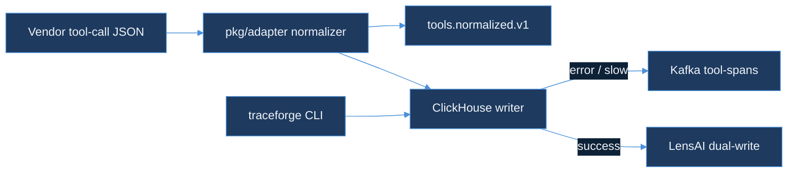

# tool-call-analyzer

> Trace, cost-attribute, and visualize AI agent tool calls.
> Part of the TraceForge observability suite.

Normalizes AI vendor tool call formats (OpenAI `tool_calls`, Anthropic `tool_use`, LangChain `AgentAction`) into a canonical `ToolCall` struct, writes them to ClickHouse for analytics, and buffers writes to Kafka instead of dropping them when ClickHouse is slow or unavailable.

Part of the [TraceForge](https://github.com/AkshantVats/infra-ai-streaming) observability stack.

## Quickstart (one command)

```bash
go test ./...
```

Expected output:
```
ok  	github.com/AkshantVats/tool-call-analyzer/pkg/adapter
ok  	github.com/AkshantVats/tool-call-analyzer/pkg/adapter/anthropic
ok  	github.com/AkshantVats/tool-call-analyzer/pkg/adapter/langchain
ok  	github.com/AkshantVats/tool-call-analyzer/pkg/adapter/openai
ok  	github.com/AkshantVats/tool-call-analyzer/pkg/adapter/registry
ok  	github.com/AkshantVats/tool-call-analyzer/pkg/clickhouse
ok  	github.com/AkshantVats/tool-call-analyzer/pkg/graph
ok  	github.com/AkshantVats/tool-call-analyzer/pkg/kafka
ok  	github.com/AkshantVats/tool-call-analyzer/pkg/lensai
ok  	github.com/AkshantVats/tool-call-analyzer/pkg/stats
ok  	github.com/AkshantVats/tool-call-analyzer/pkg/types
```

To build the CLI:

```bash
go build -o traceforge ./cmd/traceforge
```

## Architecture



Two Kafka topics carry different payloads for different consumers: `tools.normalized.v1` is the canonical event stream (`pkg/kafka.Publisher`), and `tool-spans` is a fallback buffer that only receives a span when `pkg/clickhouse.Writer.Insert` couldn't write it to ClickHouse in time (`pkg/kafka.FallbackProducer`). See [Kafka fallback for slow/failed ClickHouse writes](#kafka-fallback-for-slowfailed-clickhouse-writes) below.

## Components

| Package | Purpose |
|---|---|
| `pkg/types` | Canonical `ToolCall` struct, `ToolCategory` ontology, cost model (`EstimateCost`) |
| `pkg/adapter` | `Adapter` interface + OpenAI/Anthropic/LangChain vendor implementations |
| `pkg/clickhouse` | ClickHouse HTTP writer (`JSONEachRow` INSERT) for the `tool_calls` table |
| `pkg/kafka` | `Publisher` (canonical events → `tools.normalized.v1`) and `FallbackProducer` (buffered spans → `tool-spans`) |
| `pkg/graph` | Tool dependency graph, cycle detection, N+1 call pattern detection |
| `pkg/lensai` | Dual-write of tool cost onto LensAI's `/ingest` pipeline for unified tenant cost |
| `pkg/stats` | Per-tool P99 latency and duration alert threshold aggregation |
| `cmd/traceforge` | CLI: `graph` (dependency graph + N+1 report), `dual-write` (tool cost → LensAI) |

## API Reference

`pkg/clickhouse.Writer` talks to ClickHouse over its native HTTP interface (`INSERT INTO tool_calls FORMAT JSONEachRow`) — there is no separate ingest service in this repo. The wire contract for that write is documented as an OpenAPI 3.1 spec: [api/openapi.yaml](api/openapi.yaml).

## Kafka fallback for slow/failed ClickHouse writes

`pkg/clickhouse.Writer.Insert` normally POSTs each span straight to ClickHouse. When a `kafka.FallbackProducer` is wired in via `Writer.SetFallback`, a write that errors *or* exceeds the fallback deadline (default 100ms, override with `Writer.SetFallbackDeadline`) is buffered to the `tool-spans` Kafka topic instead of being dropped — `Insert` returns `nil` because the span wasn't lost, just diverted. Without a fallback producer, `Insert` behaves exactly as it did before this was added: the caller's own context bounds the write, and a ClickHouse error is returned as-is.

This mirrors a production lesson from Agoda/WhiteFalcon's TSDB: when the aggregator falls behind, buffer to Kafka rather than drop on the floor. `pkg/clickhouse/chaos_test.go` reproduces that scenario against a stub ClickHouse with artificial 200ms latency and asserts all spans land on the fallback topic instead of being lost.

```go
fb, err := kafka.NewFallbackFromEnv() // nil, nil if KAFKA_BROKERS unset
if err != nil {
    log.Fatalf("kafka fallback: %v", err)
}

writer := clickhouse.New(os.Getenv("CLICKHOUSE_URL"))
if fb != nil {
    writer.SetFallback(fb)
    defer fb.Close()
}
```

## Environment Variables

| Variable | Default | Purpose |
|---|---|---|
| `CLICKHOUSE_URL` | `http://localhost:8123` | ClickHouse HTTP endpoint used by `traceforge graph` and `traceforge dual-write` |
| `LENSAI_INGEST_URL` | `http://localhost:8080/ingest` | LensAI ingest endpoint used by `traceforge dual-write` |
| `KAFKA_BROKERS` | (unset) | Comma-separated brokers; when set, `kafka.NewFallbackFromEnv()` returns a producer wired to buffer spans on ClickHouse write failure/timeout |
| `KAFKA_TOPIC` | `tool-spans` | Overrides the fallback topic `kafka.NewFallbackFromEnv()` publishes to |

## Running Tests

```bash
go test ./...                 # full suite, ~0.5s, no external services required
go test ./... -race           # race detector
go test ./pkg/kafka/...       # Kafka Publisher + FallbackProducer, sarama mocks only
go test ./pkg/clickhouse/...  # ClickHouse writer + chaos test (mocked producer, no broker needed)
```

Every Kafka-facing test — publisher, fallback producer, and the chaos test — runs against `github.com/IBM/sarama/mocks`, so the full suite needs no running ClickHouse or Kafka broker. `make test-cover` and `make test-race` (see [Makefile](Makefile)) wrap the same commands with coverage/race reporting.

## Contributing

1. Fork and branch from `main`; branch names follow `<type>/<kebab-case-description>` (e.g. `feat/tool-cost-waterfall`).
2. Every new file carries `// SPDX-License-Identifier: MIT` as its first line.
3. `gofmt -l .` and `go vet ./...` must be clean on files you touch.
4. New behavior needs table-driven tests alongside it — see `pkg/kafka/fallback_test.go` for the house style.
5. Open a PR against `main`; CI runs `go test ./... -race`.

## License

MIT — see [LICENSE](../LICENSE) at the repo root.
